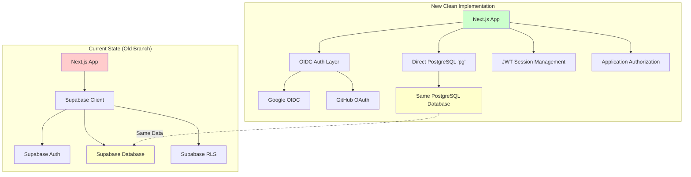
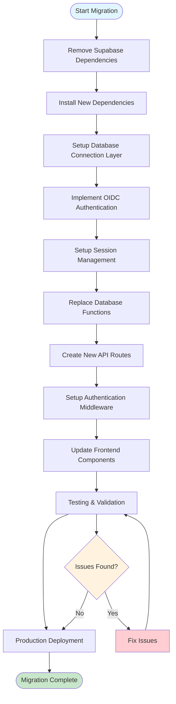
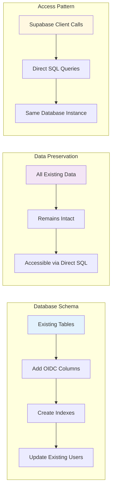
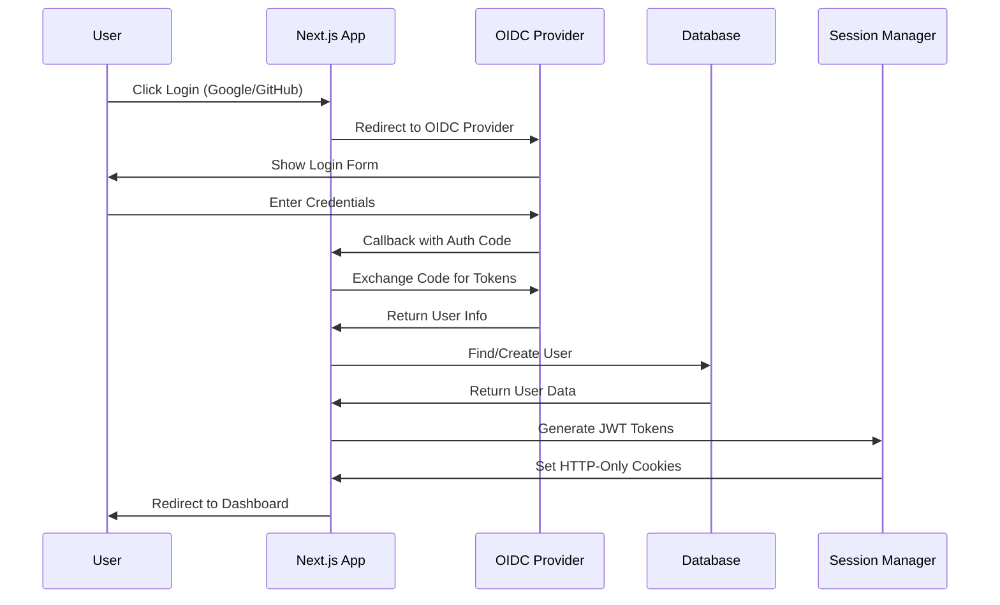

# Implementation Flow Diagram

## Migration Architecture Overview



## Implementation Flow



## Database Migration Strategy



## Authentication Flow



## API Request Flow

```mermaid
sequenceDiagram
    participant C as Client
    participant M as Middleware
    participant A as API Route
    participant S as Session Manager
    participant D as Database
    
    C->>M: API Request with Cookies
    M->>S: Validate Session
    S->>M: Return Session Data
    M->>A: Forward Request + Session
    A->>D: Execute SQL Query
    D->>A: Return Results
    A->>C: JSON Response
    
    Note over M,S: JWT Token Validation
    Note over A,D: Direct PostgreSQL Connection