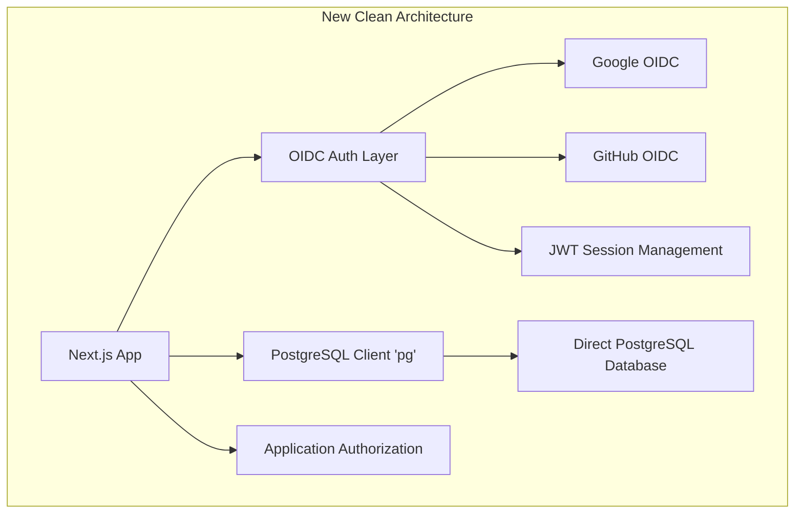

# Migration Plan: Clean Implementation - Direct PostgreSQL + OIDC Authentication

## Overview
This is a clean implementation in a new git branch that completely removes Supabase dependencies and implements:
- Direct PostgreSQL connections using the `pg` library
- OIDC authentication with Google and GitHub providers
- Application-level authorization and session management
- Raw SQL queries replacing all Supabase client calls
- **Database schema preserved** - no changes to existing tables/data structure

## Architecture



## Phase 1: Dependencies Setup

### 1.1 Remove Supabase and Install New Dependencies
```bash
# Remove Supabase completely
npm uninstall @supabase/supabase-js

# Add PostgreSQL and Auth dependencies
npm install pg @types/pg
npm install jsonwebtoken @types/jsonwebtoken
npm install openid-client
npm install cookie @types/cookie
```

### 1.2 Environment Variables
```env
# PostgreSQL Direct Connection (same database, no Supabase client)
DATABASE_URL=postgresql://postgres:[password]@[host]:[port]/[database]
DB_HOST=your-supabase-postgres-host
DB_PORT=5432
DB_NAME=postgres
DB_USER=postgres
DB_PASSWORD=your-password
DB_SSL=true

# JWT Configuration
JWT_SECRET=your-jwt-secret-key
JWT_EXPIRES_IN=7d
REFRESH_TOKEN_EXPIRES_IN=30d

# Google OIDC
GOOGLE_CLIENT_ID=your-google-client-id
GOOGLE_CLIENT_SECRET=your-google-client-secret
GOOGLE_REDIRECT_URI=http://localhost:3000/api/auth/callback/google

# GitHub OIDC
GITHUB_CLIENT_ID=your-github-client-id
GITHUB_CLIENT_SECRET=your-github-client-secret
GITHUB_REDIRECT_URI=http://localhost:3000/api/auth/callback/github

# Application Settings
NEXTAUTH_URL=http://localhost:3000
NEXTAUTH_SECRET=your-nextauth-secret
```

## Phase 2: Database Connection Layer

### 2.1 PostgreSQL Connection Manager (`src/lib/db.ts`)
```typescript
import { Pool, PoolClient, QueryResult } from 'pg';

interface DatabaseConfig {
  host: string;
  port: number;
  database: string;
  user: string;
  password: string;
  ssl: boolean | object;
  max: number;
  idleTimeoutMillis: number;
  connectionTimeoutMillis: number;
}

class DatabaseManager {
  private pool: Pool;
  private static instance: DatabaseManager;
  
  constructor() {
    const config: DatabaseConfig = {
      host: process.env.DB_HOST!,
      port: parseInt(process.env.DB_PORT || '5432'),
      database: process.env.DB_NAME!,
      user: process.env.DB_USER!,
      password: process.env.DB_PASSWORD!,
      ssl: process.env.DB_SSL === 'true' ? { rejectUnauthorized: false } : false,
      max: 20,
      idleTimeoutMillis: 30000,
      connectionTimeoutMillis: 2000,
    };
    
    this.pool = new Pool(config);
    
    this.pool.on('error', (err) => {
      console.error('Unexpected error on idle client', err);
    });
  }
  
  static getInstance(): DatabaseManager {
    if (!DatabaseManager.instance) {
      DatabaseManager.instance = new DatabaseManager();
    }
    return DatabaseManager.instance;
  }
  
  async query<T = any>(text: string, params?: any[]): Promise<T[]> {
    const start = Date.now();
    try {
      const result: QueryResult<T> = await this.pool.query(text, params);
      const duration = Date.now() - start;
      console.log('Executed query', { text: text.substring(0, 100), duration, rows: result.rowCount });
      return result.rows;
    } catch (error) {
      console.error('Database query error:', { text, params, error });
      throw error;
    }
  }
  
  async transaction<T>(callback: (client: PoolClient) => Promise<T>): Promise<T> {
    const client = await this.pool.connect();
    try {
      await client.query('BEGIN');
      const result = await callback(client);
      await client.query('COMMIT');
      return result;
    } catch (error) {
      await client.query('ROLLBACK');
      throw error;
    } finally {
      client.release();
    }
  }
  
  async close(): Promise<void> {
    await this.pool.end();
  }
  
  async healthCheck(): Promise<boolean> {
    try {
      await this.query('SELECT 1');
      return true;
    } catch {
      return false;
    }
  }
}

export const db = DatabaseManager.getInstance();
```

## Phase 3: OIDC Authentication Layer

### 3.1 OIDC Provider Configuration (`src/lib/oidc-providers.ts`)
```typescript
import { Issuer, Client, generators } from 'openid-client';

export interface OIDCProvider {
  name: string;
  client: Client;
  authUrl: (state: string, nonce: string) => string;
}

class OIDCManager {
  private providers: Map<string, OIDCProvider> = new Map();
  private initialized = false;
  
  async initialize() {
    if (this.initialized) return;
    
    try {
      // Google OIDC Setup
      const googleIssuer = await Issuer.discover('https://accounts.google.com');
      const googleClient = new googleIssuer.Client({
        client_id: process.env.GOOGLE_CLIENT_ID!,
        client_secret: process.env.GOOGLE_CLIENT_SECRET!,
        redirect_uris: [process.env.GOOGLE_REDIRECT_URI!],
        response_types: ['code'],
      });
      
      this.providers.set('google', {
        name: 'google',
        client: googleClient,
        authUrl: (state: string, nonce: string) => googleClient.authorizationUrl({
          scope: 'openid email profile',
          state,
          nonce,
        }),
      });
      
      // GitHub OAuth Setup (GitHub doesn't support OIDC, using OAuth2)
      const githubClient = new Issuer({
        issuer: 'https://github.com',
        authorization_endpoint: 'https://github.com/login/oauth/authorize',
        token_endpoint: 'https://github.com/login/oauth/access_token',
        userinfo_endpoint: 'https://api.github.com/user',
      }).Client;
      
      const githubOAuthClient = new githubClient({
        client_id: process.env.GITHUB_CLIENT_ID!,
        client_secret: process.env.GITHUB_CLIENT_SECRET!,
        redirect_uris: [process.env.GITHUB_REDIRECT_URI!],
        response_types: ['code'],
      });
      
      this.providers.set('github', {
        name: 'github',
        client: githubOAuthClient,
        authUrl: (state: string) => githubOAuthClient.authorizationUrl({
          scope: 'user:email',
          state,
        }),
      });
      
      this.initialized = true;
    } catch (error) {
      console.error('Failed to initialize OIDC providers:', error);
      throw error;
    }
  }
  
  getProvider(name: string): OIDCProvider | undefined {
    return this.providers.get(name);
  }
  
  getAllProviders(): OIDCProvider[] {
    return Array.from(this.providers.values());
  }
}

export const oidcManager = new OIDCManager();
```

### 3.2 Authentication Service (`src/lib/auth-service.ts`)
```typescript
import jwt from 'jsonwebtoken';
import { db } from './db';
import { oidcManager } from './oidc-providers';
import { generators } from 'openid-client';

export interface User {
  id: string;
  email: string;
  name?: string;
  avatar_url?: string;
  role: 'admin' | 'free' | 'pay' | 'vip';
  provider: string;
  provider_id: string;
  created_at: Date;
  updated_at: Date;
}

export interface AuthTokens {
  accessToken: string;
  refreshToken: string;
  user: User;
}

export interface OIDCUserInfo {
  email: string;
  name?: string;
  picture?: string;
  sub: string;
}

export class AuthService {
  private readonly JWT_SECRET = process.env.JWT_SECRET!;
  private readonly JWT_EXPIRES_IN = process.env.JWT_EXPIRES_IN || '7d';
  private readonly REFRESH_EXPIRES_IN = process.env.REFRESH_TOKEN_EXPIRES_IN || '30d';
  
  constructor() {
    oidcManager.initialize().catch(console.error);
  }
  
  generateTokens(user: User): AuthTokens {
    const payload = { 
      userId: user.id, 
      email: user.email, 
      role: user.role,
      provider: user.provider 
    };
    
    const accessToken = jwt.sign(payload, this.JWT_SECRET, {
      expiresIn: this.JWT_EXPIRES_IN,
      issuer: 'macau-law-kb',
      audience: 'macau-law-kb-users',
    });
    
    const refreshToken = jwt.sign(payload, this.JWT_SECRET, {
      expiresIn: this.REFRESH_EXPIRES_IN,
      issuer: 'macau-law-kb',
      audience: 'macau-law-kb-users',
    });
    
    return { accessToken, refreshToken, user };
  }
  
  verifyToken(token: string): any {
    return jwt.verify(token, this.JWT_SECRET, {
      issuer: 'macau-law-kb',
      audience: 'macau-law-kb-users',
    });
  }
  
  generateAuthState(): { state: string; nonce: string } {
    return {
      state: generators.state(),
      nonce: generators.nonce(),
    };
  }
  
  getAuthUrl(provider: string, state: string, nonce?: string): string {
    const oidcProvider = oidcManager.getProvider(provider);
    if (!oidcProvider) {
      throw new Error(`Unknown provider: ${provider}`);
    }
    
    return provider === 'github' 
      ? oidcProvider.authUrl(state, '')
      : oidcProvider.authUrl(state, nonce!);
  }
  
  async handleOIDCCallback(
    provider: string, 
    code: string, 
    state: string, 
    nonce?: string
  ): Promise<AuthTokens> {
    const oidcProvider = oidcManager.getProvider(provider);
    if (!oidcProvider) {
      throw new Error(`Unknown provider: ${provider}`);
    }
    
    try {
      let userInfo: OIDCUserInfo;
      
      if (provider === 'github') {
        // Handle GitHub OAuth2
        const tokenSet = await oidcProvider.client.callback(
          process.env.GITHUB_REDIRECT_URI!,
          { code, state },
          { state }
        );
        
        const userResponse = await oidcProvider.client.userinfo(tokenSet.access_token!);
        userInfo = {
          email: userResponse.email!,
          name: userResponse.name,
          picture: userResponse.avatar_url,
          sub: userResponse.id.toString(),
        };
      } else {
        // Handle Google OIDC
        const tokenSet = await oidcProvider.client.callback(
          process.env.GOOGLE_REDIRECT_URI!,
          { code, state },
          { state, nonce }
        );
        
        const claims = tokenSet.claims();
        userInfo = {
          email: claims.email!,
          name: claims.name,
          picture: claims.picture,
          sub: claims.sub,
        };
      }
      
      const user = await this.findOrCreateUser(provider, userInfo);
      return this.generateTokens(user);
    } catch (error) {
      console.error('OIDC callback error:', error);
      throw new Error('Authentication failed');
    }
  }
  
  private async findOrCreateUser(provider: string, userInfo: OIDCUserInfo): Promise<User> {
    return db.transaction(async (client) => {
      // Try to find existing user by email or provider info
      const existingUsers = await client.query<User>(
        'SELECT * FROM users WHERE email = $1 OR (provider = $2 AND provider_id = $3)',
        [userInfo.email, provider, userInfo.sub]
      );
      
      if (existingUsers.rows.length > 0) {
        const user = existingUsers.rows[0];
        
        // Update user info
        const updatedUsers = await client.query<User>(
          `UPDATE users 
           SET name = COALESCE($1, name),
               avatar_url = COALESCE($2, avatar_url),
               provider = $3,
               provider_id = $4,
               updated_at = NOW()
           WHERE id = $5
           RETURNING *`,
          [userInfo.name, userInfo.picture, provider, userInfo.sub, user.id]
        );
        
        return updatedUsers.rows[0];
      }
      
      // Create new user
      const newUsers = await client.query<User>(
        `INSERT INTO users (email, name, avatar_url, role, provider, provider_id, created_at, updated_at)
         VALUES ($1, $2, $3, $4, $5, $6, NOW(), NOW())
         RETURNING *`,
        [userInfo.email, userInfo.name, userInfo.picture, 'free', provider, userInfo.sub]
      );
      
      const newUser = newUsers.rows[0];
      
      // Create user credits
      await client.query(
        `INSERT INTO user_credits (user_id, total_tokens, used_tokens, remaining_tokens, created_at, updated_at)
         VALUES ($1, $2, 0, $2, NOW(), NOW())`,
        [newUser.id, 1000]
      );
      
      return newUser;
    });
  }
  
  async refreshAccessToken(refreshToken: string): Promise<AuthTokens> {
    try {
      const payload = this.verifyToken(refreshToken);
      
      const [user] = await db.query<User>(
        'SELECT * FROM users WHERE id = $1',
        [payload.userId]
      );
      
      if (!user) {
        throw new Error('User not found');
      }
      
      return this.generateTokens(user);
    } catch (error) {
      console.error('Token refresh error:', error);
      throw new Error('Invalid refresh token');
    }
  }
  
  async getUserById(userId: string): Promise<User | null> {
    const [user] = await db.query<User>(
      'SELECT * FROM users WHERE id = $1',
      [userId]
    );
    
    return user || null;
  }
}

export const authService = new AuthService();
```

## Phase 4: Session Management

### 4.1 Session Utilities (`src/lib/session.ts`)
```typescript
import { NextRequest, NextResponse } from 'next/server';
import { authService } from './auth-service';

const ACCESS_TOKEN_COOKIE = 'access_token';
const REFRESH_TOKEN_COOKIE = 'refresh_token';
const COOKIE_OPTIONS = {
  httpOnly: true,
  secure: process.env.NODE_ENV === 'production',
  sameSite: 'lax' as const,
  path: '/',
};

export interface SessionData {
  userId: string;
  email: string;
  role: string;
  provider: string;
}

export class SessionManager {
  static setAuthCookies(response: NextResponse, tokens: { accessToken: string; refreshToken: string }) {
    response.cookies.set(ACCESS_TOKEN_COOKIE, tokens.accessToken, {
      ...COOKIE_OPTIONS,
      maxAge: 7 * 24 * 60 * 60, // 7 days
    });
    
    response.cookies.set(REFRESH_TOKEN_COOKIE, tokens.refreshToken, {
      ...COOKIE_OPTIONS,
      maxAge: 30 * 24 * 60 * 60, // 30 days
    });
  }
  
  static clearAuthCookies(response: NextResponse) {
    response.cookies.delete(ACCESS_TOKEN_COOKIE);
    response.cookies.delete(REFRESH_TOKEN_COOKIE);
  }
  
  static async getSession(request: NextRequest): Promise<SessionData | null> {
    const accessToken = request.cookies.get(ACCESS_TOKEN_COOKIE)?.value;
    
    if (!accessToken) {
      return null;
    }
    
    try {
      const payload = authService.verifyToken(accessToken);
      return {
        userId: payload.userId,
        email: payload.email,
        role: payload.role,
        provider: payload.provider,
      };
    } catch (error) {
      // Try to refresh token
      const refreshToken = request.cookies.get(REFRESH_TOKEN_COOKIE)?.value;
      if (refreshToken) {
        try {
          const newTokens = await authService.refreshAccessToken(refreshToken);
          return {
            userId: newTokens.user.id,
            email: newTokens.user.email,
            role: newTokens.user.role,
            provider: newTokens.user.provider,
          };
        } catch (refreshError) {
          console.error('Token refresh failed:', refreshError);
        }
      }
      
      return null;
    }
  }
  
  static async requireSession(request: NextRequest): Promise<SessionData> {
    const session = await this.getSession(request);
    if (!session) {
      throw new Error('Authentication required');
    }
    return session;
  }
}
```

## Phase 5: Database Service Layer (Replace Supabase Functions)

### 5.1 Complete Database Service (`src/lib/database.ts`)
```typescript
import { db } from './db';
import { SessionData } from './session';

export interface DocumentResult {
  id: number;
  content: string;
  metadata: any;
  similarity: number;
}

/**
 * Search documents using vector similarity
 */
export async function searchDocuments(
  session: SessionData,
  embedding: number[],
  matchCount: number = 10,
  filter: Record<string, any> = {}
): Promise<DocumentResult[]> {
  try {
    const embeddingStr = `[${embedding.join(',')}]`;
    
    const results = await db.query<DocumentResult>(
      `SELECT id, content, metadata, 
              (embedding <=> $1::vector) as similarity
       FROM documents 
       WHERE (embedding <=> $1::vector) < 0.8
       ORDER BY similarity ASC 
       LIMIT $2`,
      [embeddingStr, matchCount]
    );
    
    return results;
  } catch (error) {
    console.error('Vector search error:', error);
    throw new Error('Failed to search documents');
  }
}

/**
 * Save search history
 */
export async function saveSearchHistory(
  session: SessionData,
  query: string,
  documentIds: number[],
  tokensUsed: number
): Promise<string> {
  try {
    const [result] = await db.query<{ id: string }>(
      `INSERT INTO search_history (user_id, query, document_ids, tokens_used, created_at)
       VALUES ($1, $2, $3, $4, NOW())
       RETURNING id`,
      [session.userId, query, documentIds, tokensUsed]
    );
    
    return result.id;
  } catch (error) {
    console.error('Save search history error:', error);
    throw new Error('Failed to save search history');
  }
}

/**
 * Save Q&A history
 */
export async function saveQAHistory(
  session: SessionData,
  question: string,
  answer: string,
  documentIds: number[],
  tokensUsed: number
): Promise<string> {
  try {
    const [result] = await db.query<{ id: string }>(
      `INSERT INTO qa_history (user_id, question, answer, document_ids, tokens_used, created_at)
       VALUES ($1, $2, $3, $4, $5, NOW())
       RETURNING id`,
      [session.userId, question, answer, documentIds, tokensUsed]
    );
    
    return result.id;
  } catch (error) {
    console.error('Save Q&A history error:', error);
    throw new Error('Failed to save Q&A history');
  }
}

/**
 * Save conversation messages
 */
export async function saveConversationMessages(
  conversationId: string,
  messages: Array<{ 
    role: 'user' | 'assistant'; 
    content: string; 
    documents_ids?: number[]; 
    tokens_used?: number; 
    timestamp: string 
  }>
): Promise<void> {
  try {
    if (!messages || messages.length === 0) return;
    
    const messagesToInsert = messages.slice(-2).map((message) => [
      conversationId,
      message.role,
      message.content,
      message.documents_ids || null,
      message.tokens_used || 0,
      message.timestamp
    ]);
    
    const placeholders = messagesToInsert.map((_, i) => 
      `($${i * 6 + 1}, $${i * 6 + 2}, $${i * 6 + 3}, $${i * 6 + 4}, $${i * 6 + 5}, $${i * 6 + 6})`
    ).join(', ');
    
    await db.query(
      `INSERT INTO consultant_messages (conversation_id, role, content, document_ids, tokens_used, created_at)
       VALUES ${placeholders}`,
      messagesToInsert.flat()
    );
  } catch (error) {
    console.error('Save conversation messages error:', error);
    throw new Error('Failed to save conversation messages');
  }
}

/**
 * Save conversation
 */
export async function saveConversation(
  session: SessionData,
  conversationId: string | null,
  messages: Array<{ 
    role: 'user' | 'assistant'; 
    content: string; 
    documents_ids?: number[]; 
    tokens_used?: number; 
    timestamp: string 
  }>,
  title?: string,
  totalTokens?: number,
  modelUsed?: string
): Promise<string> {
  return db.transaction(async (client) => {
    let finalConversationId: string;
    
    if (conversationId) {
      // Update existing conversation
      const [updated] = await client.query<{ id: string }>(
        `UPDATE consultant_conversations 
         SET updated_at = NOW(),
             total_tokens = COALESCE($1, total_tokens),
             model_used = COALESCE($2, model_used)
         WHERE id = $3 AND user_id = $4
         RETURNING id`,
        [totalTokens, modelUsed, conversationId, session.userId]
      );
      
      if (!updated) {
        throw new Error('Conversation not found or access denied');
      }
      
      finalConversationId = updated.id;
    } else {
      // Create new conversation
      const conversationTitle = title || `對話 ${new Date().toLocaleDateString('zh-TW')}`;
      
      const [created] = await client.query<{ id: string }>(
        `INSERT INTO consultant_conversations (user_id, title, model_used, total_tokens, created_at, updated_at)
         VALUES ($1, $2, $3, $4, NOW(), NOW())
         RETURNING id`,
        [session.userId, conversationTitle, modelUsed || 'gemini-2.5-flash-preview-05-20', totalTokens || 0]
      );
      
      finalConversationId = created.id;
    }
    
    // Save messages
    if (messages && messages.length > 0) {
      await saveConversationMessages(finalConversationId, messages);
    }
    
    return finalConversationId;
  });
}

/**
 * Get user profile
 */
export async function getUserProfile(session: SessionData): Promise<any> {
  try {
    const [user] = await db.query(
      `SELECT u.id, u.email, u.name, u.avatar_url, u.role, u.provider, u.created_at, u.updated_at,
              uc.total_tokens, uc.used_tokens, uc.remaining_tokens, uc.last_reset
       FROM users u
       LEFT JOIN user_credits uc ON u.id = uc.user_id
       WHERE u.id = $1`,
      [session.userId]
    );
    
    if (!user) {
      throw new Error('User not found');
    }
    
    return user;
  } catch (error) {
    console.error('Get user profile error:', error);
    throw new Error('Failed to get user profile');
  }
}

/**
 * Update user token usage
 */
export async function updateTokenUsage(
  session: SessionData,
  tokensUsed: number
): Promise<void> {
  try {
    const [result] = await db.query<{ remaining_tokens: number }>(
      `UPDATE user_credits 
       SET used_tokens = used_tokens + $1,
           remaining_tokens = remaining_tokens - $1,
           updated_at = NOW()
       WHERE user_id = $2
       RETURNING remaining_tokens`,
      [tokensUsed, session.userId]
    );
    
    if (!result) {
      throw new Error('User credits not found');
    }
    
    if (result.remaining_tokens < 0) {
      throw new Error('Insufficient tokens');
    }
  } catch (error) {
    console.error('Update token usage error:', error);
    throw new Error('Failed to update token usage');
  }
}

/**
 * Check token availability
 */
export async function checkTokenAvailability(
  session: SessionData,
  requiredTokens: number
): Promise<boolean> {
  try {
    const [result] = await db.query<{ remaining_tokens: number }>(
      'SELECT remaining_tokens FROM user_credits WHERE user_id = $1',
      [session.userId]
    );
    
    return result ? result.remaining_tokens >= requiredTokens : false;
  } catch (error) {
    console.error('Check token availability error:', error);
    return false;
  }
}

/**
 * Get law document by ID
 */
export async function getLawDocument(lawId: string): Promise<any> {
  try {
    const [document] = await db.query(
      'SELECT * FROM law WHERE id = $1',
      [lawId]
    );
    
    if (!document) {
      throw new Error('Law document not found');
    }
    
    return document;
  } catch (error) {
    console.error('Get law document error:', error);
    throw new Error('Failed to get law document');
  }
}
```

## Phase 6: Database Schema Updates (Minimal Changes)

### 6.1 Add Required Columns Only
```sql
-- Add columns for OIDC authentication (keeping existing structure)
ALTER TABLE users ADD COLUMN IF NOT EXISTS provider TEXT DEFAULT 'oidc';
ALTER TABLE users ADD COLUMN IF NOT EXISTS provider_id TEXT;

-- Create indexes for new queries
CREATE INDEX IF NOT EXISTS idx_users_provider ON users(provider, provider_id);
CREATE INDEX IF NOT EXISTS idx_search_history_user_created ON search_history(user_id, created_at DESC);
CREATE INDEX IF NOT EXISTS idx_qa_history_user_created ON qa_history(user_id, created_at DESC);

-- Update existing users to have provider info (one-time migration)
UPDATE users SET provider = 'legacy', provider_id = id::text WHERE provider IS NULL;
```

## Phase 7: API Routes Implementation

### 7.1 Authentication Routes

#### `/api/auth/[provider]/route.ts`
```typescript
import { NextRequest, NextResponse } from 'next/server';
import { authService } from '@/lib/auth-service';

export async function GET(
  request: NextRequest,
  { params }: { params: { provider: string } }
) {
  try {
    const { provider } = params;
    
    if (!['google', 'github'].includes(provider)) {
      return NextResponse.json({ error: 'Invalid provider' }, { status: 400 });
    }
    
    const { state, nonce } = authService.generateAuthState();
    const authUrl = authService.getAuthUrl(provider, state, nonce);
    
    const response = NextResponse.redirect(authUrl);
    response.cookies.set('oauth_state', state, { httpOnly: true, maxAge: 600 });
    response.cookies.set('oauth_nonce', nonce, { httpOnly: true, maxAge: 600 });
    
    return response;
  } catch (error) {
    console.error('Auth initiation error:', error);
    return NextResponse.json({ error: 'Authentication failed' }, { status: 500 });
  }
}
```

#### `/api/auth/callback/[provider]/route.ts`
```typescript
import { NextRequest, NextResponse } from 'next/server';
import { authService } from '@/lib/auth-service';
import { SessionManager } from '@/lib/session';

export async function GET(
  request: NextRequest,
  { params }: { params: { provider: string } }
) {
  try {
    const { provider } = params;
    const { searchParams } = new URL(request.url);
    
    const code = searchParams.get('code');
    const state = searchParams.get('state');
    const storedState = request.cookies.get('oauth_state')?.value;
    const storedNonce = request.cookies.get('oauth_nonce')?.value;
    
    if (!code || !state || !storedState || state !== storedState) {
      return NextResponse.json({ error: 'Invalid authentication state' }, { status: 400 });
    }
    
    const tokens = await authService.handleOIDCCallback(provider, code, state, storedNonce);
    
    const response = NextResponse.redirect(new URL('/', request.url));
    SessionManager.setAuthCookies(response, tokens);
    
    // Clear OAuth state cookies
    response.cookies.delete('oauth_state');
    response.cookies.delete('oauth_nonce');
    
    return response;
  } catch (error) {
    console.error('Auth callback error:', error);
    return NextResponse.redirect(new URL('/auth/error', request.url));
  }
}
```

### 7.2 Protected API Route Example

#### `/api/search/route.ts`
```typescript
import { NextRequest, NextResponse } from 'next/server';
import { SessionManager } from '@/lib/session';
import { searchDocuments, saveSearchHistory, updateTokenUsage, checkTokenAvailability } from '@/lib/database';
import { generateEmbedding } from '@/lib/embeddings';

export async function POST(request: NextRequest) {
  try {
    const session = await SessionManager.requireSession(request);
    const { query, matchCount = 10 } = await request.json();
    
    if (!query || typeof query !== 'string') {
      return NextResponse.json({ error: 'Query is required' }, { status: 400 });
    }
    
    // Check token availability
    const estimatedTokens = Math.ceil(query.length / 4) + 100; // Rough estimation
    const hasTokens = await checkTokenAvailability(session, estimatedTokens);
    
    if (!hasTokens) {
      return NextResponse.json({ error: 'Insufficient tokens' }, { status: 402 });
    }
    
    // Generate embedding for the query
    const embedding = await generateEmbedding(query);
    
    // Search documents
    const results = await searchDocuments(embedding, matchCount);
    
    // Save search history and update token usage
    const documentIds = results.map(r => r.id);
    await saveSearchHistory(session, query, documentIds, estimatedTokens);
    await updateTokenUsage(session, estimatedTokens);
    
    return NextResponse.json({
      results,
      tokensUsed: estimatedTokens,
      query
    });
  } catch (error) {
    console.error('Search API error:', error);
    
    if (error instanceof Error && error.message === 'Authentication required') {
      return NextResponse.json({ error: 'Authentication required' }, { status: 401 });
    }
    
    return NextResponse.json({ error: 'Search failed' }, { status: 500 });
  }
}
```

#### `/api/consultant/route.ts`
```typescript
import { NextRequest, NextResponse } from 'next/server';
import { SessionManager } from '@/lib/session';
import { saveConversation, updateTokenUsage, checkTokenAvailability } from '@/lib/database';
import { generateResponse } from '@/lib/ai-service';

export async function POST(request: NextRequest) {
  try {
    const session = await SessionManager.requireSession(request);
    const { 
      messages, 
      conversationId, 
      model = 'gemini-2.5-flash-preview-05-20' 
    } = await request.json();
    
    if (!messages || !Array.isArray(messages)) {
      return NextResponse.json({ error: 'Messages are required' }, { status: 400 });
    }
    
    // Estimate token usage
    const estimatedTokens = messages.reduce((total, msg) => 
      total + Math.ceil(msg.content.length / 4), 0) + 500;
    
    const hasTokens = await checkTokenAvailability(session, estimatedTokens);
    if (!hasTokens) {
      return NextResponse.json({ error: 'Insufficient tokens' }, { status: 402 });
    }
    
    // Generate AI response
    const { response, actualTokens, documentIds } = await generateResponse(messages, model);
    
    // Prepare messages for saving
    const messagesToSave = [
      ...messages.slice(-1), // Last user message
      {
        role: 'assistant' as const,
        content: response,
        documents_ids: documentIds,
        tokens_used: actualTokens,
        timestamp: new Date().toISOString()
      }
    ];
    
    // Save conversation and update tokens
    const finalConversationId = await saveConversation(
      session,
      conversationId,
      messagesToSave,
      undefined,
      actualTokens,
      model
    );
    
    await updateTokenUsage(session, actualTokens);
    
    return NextResponse.json({
      response,
      conversationId: finalConversationId,
      tokensUsed: actualTokens,
      documentIds
    });
  } catch (error) {
    console.error('Consultant API error:', error);
    
    if (error instanceof Error && error.message === 'Authentication required') {
      return NextResponse.json({ error: 'Authentication required' }, { status: 401 });
    }
    
    return NextResponse.json({ error: 'Consultation failed' }, { status: 500 });
  }
}
```

#### `/api/profile/route.ts`
```typescript
import { NextRequest, NextResponse } from 'next/server';
import { SessionManager } from '@/lib/session';
import { getUserProfile } from '@/lib/database';

export async function GET(request: NextRequest) {
  try {
    const session = await SessionManager.requireSession(request);
    const profile = await getUserProfile(session);
    
    return NextResponse.json(profile);
  } catch (error) {
    console.error('Profile API error:', error);
    
    if (error instanceof Error && error.message === 'Authentication required') {
      return NextResponse.json({ error: 'Authentication required' }, { status: 401 });
    }
    
    return NextResponse.json({ error: 'Failed to get profile' }, { status: 500 });
  }
}
```

## Phase 8: Middleware for Authentication

### 8.1 Authentication Middleware (`src/middleware.ts`)
```typescript
import { NextRequest, NextResponse } from 'next/server';
import { SessionManager } from '@/lib/session';

const protectedPaths = [
  '/api/search',
  '/api/consultant',
  '/api/profile',
  '/dashboard',
  '/consultant',
  '/search'
];

const authPaths = [
  '/api/auth',
  '/auth'
];

export async function middleware(request: NextRequest) {
  const { pathname } = request.nextUrl;
  
  // Skip middleware for auth paths and static files
  if (
    authPaths.some(path => pathname.startsWith(path)) ||
    pathname.startsWith('/_next') ||
    pathname.startsWith('/favicon') ||
    pathname.includes('.')
  ) {
    return NextResponse.next();
  }
  
  // Check if path requires authentication
  const isProtectedPath = protectedPaths.some(path => pathname.startsWith(path));
  
  if (isProtectedPath) {
    const session = await SessionManager.getSession(request);
    
    if (!session) {
      // Redirect to login for protected pages
      if (pathname.startsWith('/api/')) {
        return NextResponse.json({ error: 'Authentication required' }, { status: 401 });
      } else {
        return NextResponse.redirect(new URL('/auth/login', request.url));
      }
    }
    
    // Add session data to headers for API routes
    if (pathname.startsWith('/api/')) {
      const response = NextResponse.next();
      response.headers.set('x-user-id', session.userId);
      response.headers.set('x-user-email', session.email);
      response.headers.set('x-user-role', session.role);
      return response;
    }
  }
  
  return NextResponse.next();
}

export const config = {
  matcher: [
    '/((?!_next/static|_next/image|favicon.ico).*)',
  ],
};
```

## Phase 9: Frontend Components Updates

### 9.1 Authentication Context (`src/contexts/AuthContext.tsx`)
```typescript
'use client';

import React, { createContext, useContext, useEffect, useState } from 'react';

interface User {
  id: string;
  email: string;
  name?: string;
  avatar_url?: string;
  role: string;
  provider: string;
  total_tokens: number;
  used_tokens: number;
  remaining_tokens: number;
}

interface AuthContextType {
  user: User | null;
  loading: boolean;
  login: (provider: 'google' | 'github') => void;
  logout: () => void;
  refreshProfile: () => Promise<void>;
}

const AuthContext = createContext<AuthContextType | undefined>(undefined);

export function AuthProvider({ children }: { children: React.ReactNode }) {
  const [user, setUser] = useState<User | null>(null);
  const [loading, setLoading] = useState(true);
  
  const fetchProfile = async () => {
    try {
      const response = await fetch('/api/profile');
      if (response.ok) {
        const profile = await response.json();
        setUser(profile);
      } else {
        setUser(null);
      }
    } catch (error) {
      console.error('Failed to fetch profile:', error);
      setUser(null);
    } finally {
      setLoading(false);
    }
  };
  
  useEffect(() => {
    fetchProfile();
  }, []);
  
  const login = (provider: 'google' | 'github') => {
    window.location.href = `/api/auth/${provider}`;
  };
  
  const logout = async () => {
    try {
      await fetch('/api/auth/logout', { method: 'POST' });
      setUser(null);
      window.location.href = '/';
    } catch (error) {
      console.error('Logout error:', error);
    }
  };
  
  const refreshProfile = async () => {
    await fetchProfile();
  };
  
  return (
    <AuthContext.Provider value={{ user, loading, login, logout, refreshProfile }}>
      {children}
    </AuthContext.Provider>
  );
}

export function useAuth() {
  const context = useContext(AuthContext);
  if (context === undefined) {
    throw new Error('useAuth must be used within an AuthProvider');
  }
  return context;
}
```

### 9.2 Login Component (`src/components/auth/LoginForm.tsx`)
```typescript
'use client';

import React from 'react';
import { useAuth } from '@/contexts/AuthContext';
import { Button } from '@/components/ui/button';
import { Card, CardContent, CardDescription, CardHeader, CardTitle } from '@/components/ui/card';

export function LoginForm() {
  const { login, loading } = useAuth();
  
  if (loading) {
    return (
      <div className="flex items-center justify-center min-h-screen">
        <div className="animate-spin rounded-full h-32 w-32 border-b-2 border-gray-900"></div>
      </div>
    );
  }
  
  return (
    <div className="flex items-center justify-center min-h-screen bg-gray-50">
      <Card className="w-full max-w-md">
        <CardHeader className="space-y-1">
          <CardTitle className="text-2xl text-center">登入澳門法律知識庫</CardTitle>
          <CardDescription className="text-center">
            選擇您的登入方式
          </CardDescription>
        </CardHeader>
        <CardContent className="space-y-4">
          <Button
            onClick={() => login('google')}
            variant="outline"
            className="w-full"
            size="lg"
          >
            <svg className="w-5 h-5 mr-2" viewBox="0 0 24 24">
              <path
                fill="currentColor"
                d="M22.56 12.25c0-.78-.07-1.53-.2-2.25H12v4.26h5.92c-.26 1.37-1.04 2.53-2.21 3.31v2.77h3.57c2.08-1.92 3.28-4.74 3.28-8.09z"
              />
              <path
                fill="currentColor"
                d="M12 23c2.97 0 5.46-.98 7.28-2.66l-3.57-2.77c-.98.66-2.23 1.06-3.71 1.06-2.86 0-5.29-1.93-6.16-4.53H2.18v2.84C3.99 20.53 7.7 23 12 23z"
              />
              <path
                fill="currentColor"
                d="M5.84 14.09c-.22-.66-.35-1.36-.35-2.09s.13-1.43.35-2.09V7.07H2.18C1.43 8.55 1 10.22 1 12s.43 3.45 1.18 4.93l2.85-2.22.81-.62z"
              />
              <path
                fill="currentColor"
                d="M12 5.38c1.62 0 3.06.56 4.21 1.64l3.15-3.15C17.45 2.09 14.97 1 12 1 7.7 1 3.99 3.47 2.18 7.07l3.66 2.84c.87-2.6 3.3-4.53 6.16-4.53z"
              />
            </svg>
            使用 Google 登入
          </Button>
          
          <Button
            onClick={() => login('github')}
            variant="outline"
            className="w-full"
            size="lg"
          >
            <svg className="w-5 h-5 mr-2" fill="currentColor" viewBox="0 0 24 24">
              <path d="M12 0c-6.626 0-12 5.373-12 12 0 5.302 3.438 9.8 8.207 11.387.599.111.793-.261.793-.577v-2.234c-3.338.726-4.033-1.416-4.033-1.416-.546-1.387-1.333-1.756-1.333-1.756-1.089-.745.083-.729.083-.729 1.205.084 1.839 1.237 1.839 1.237 1.07 1.834 2.807 1.304 3.492.997.107-.775.418-1.305.762-1.604-2.665-.305-5.467-1.334-5.467-5.931 0-1.311.469-2.381 1.236-3.221-.124-.303-.535-1.524.117-3.176 0 0 1.008-.322 3.301 1.23.957-.266 1.983-.399 3.003-.404 1.02.005 2.047.138 3.006.404 2.291-1.552 3.297-1.23 3.297-1.23.653 1.653.242 2.874.118 3.176.77.84 1.235 1.911 1.235 3.221 0 4.609-2.807 5.624-5.479 5.921.43.372.823 1.102.823 2.222v3.293c0 .319.192.694.801.576 4.765-1.589 8.199-6.086 8.199-11.386 0-6.627-5.373-12-12-12z"/>
            </svg>
            使用 GitHub 登入
          </Button>
        </CardContent>
      </Card>
    </div>
  );
}
```

## Phase 10: Supporting Services

### 10.1 Embedding Service (`src/lib/embeddings.ts`)
```typescript
import { GoogleGenerativeAI } from '@google/generative-ai';

const genAI = new GoogleGenerativeAI(process.env.GEMINI_API_KEY!);

export async function generateEmbedding(text: string): Promise<number[]> {
  try {
    const model = genAI.getGenerativeModel({ model: 'text-embedding-004' });
    const result = await model.embedContent(text);
    return result.embedding.values;
  } catch (error) {
    console.error('Embedding generation error:', error);
    throw new Error('Failed to generate embedding');
  }
}
```

### 10.2 AI Service (`src/lib/ai-service.ts`)
```typescript
import { GoogleGenerativeAI } from '@google/generative-ai';
import { searchDocuments } from './database';

const genAI = new GoogleGenerativeAI(process.env.GEMINI_API_KEY!);

interface Message {
  role: 'user' | 'assistant';
  content: string;
}

export async function generateResponse(
  messages: Message[],
  model: string = 'gemini-2.5-flash-preview-05-20'
): Promise<{ response: string; actualTokens: number; documentIds: number[] }> {
  try {
    const lastUserMessage = messages.filter(m => m.role === 'user').pop();
    if (!lastUserMessage) {
      throw new Error('No user message found');
    }
    
    // Generate embedding and search for relevant documents
    const { generateEmbedding } = await import('./embeddings');
    const embedding = await generateEmbedding(lastUserMessage.content);
    
    // Mock session for document search (in real implementation, pass actual session)
    const mockSession = { userId: 'system', email: 'system', role: 'system', provider: 'system' };
    const relevantDocs = await searchDocuments(mockSession, embedding, 5);
    
    // Prepare context from relevant documents
    const context = relevantDocs.map(doc => 
      `文件 ${doc.id}: ${doc.content.substring(0, 500)}...`
    ).join('\n\n');
    
    // Prepare conversation history
    const conversationHistory = messages.map(msg => 
      `${msg.role === 'user' ? '用戶' : '助手'}: ${msg.content}`
    ).join('\n');
    
    const prompt = `
你是澳門法律知識庫的AI助手。請根據以下相關法律文件和對話歷史，回答用戶的問題。

相關法律文件：
${context}

對話歷史：
${conversationHistory}

請提供準確、專業的法律建議，並引用相關的法律條文。如果問題超出澳門法律範圍，請說明並建議諮詢專業律師。
`;
    
    const aiModel = genAI.getGenerativeModel({ model });
    const result = await aiModel.generateContent(prompt);
    const response = result.response.text();
    
    // Estimate token usage (rough calculation)
    const actualTokens = Math.ceil((prompt.length + response.length) / 4);
    const documentIds = relevantDocs.map(doc => doc.id);
    
    return {
      response,
      actualTokens,
      documentIds
    };
  } catch (error) {
    console.error('AI response generation error:', error);
    throw new Error('Failed to generate AI response');
  }
}
```

## Phase 11: Testing Strategy

### 11.1 Database Connection Tests (`tests/db.test.ts`)
```typescript
import { db } from '@/lib/db';

describe('Database Connection', () => {
  beforeAll(async () => {
    // Setup test database if needed
  });
  
  afterAll(async () => {
    await db.close();
  });
  
  test('should connect to database', async () => {
    const isHealthy = await db.healthCheck();
    expect(isHealthy).toBe(true);
  });
  
  test('should execute simple query', async () => {
    const result = await db.query('SELECT 1 as test');
    expect(result).toHaveLength(1);
    expect(result[0].test).toBe(1);
  });
  
  test('should handle transactions', async () => {
    const result = await db.transaction(async (client) => {
      const [row] = await client.query('SELECT 1 as test');
      return row.test;
    });
    
    expect(result).toBe(1);
  });
});
```

### 11.2 Authentication Tests (`tests/auth.test.ts`)
```typescript
import { authService } from '@/lib/auth-service';
import { SessionManager } from '@/lib/session';

describe('Authentication Service', () => {
  test('should generate valid JWT tokens', () => {
    const mockUser = {
      id: 'test-user-id',
      email: 'test@example.com',
      role: 'free' as const,
      provider: 'google',
      name: 'Test User',
      avatar_url: null,
      provider_id: 'google-123',
      created_at: new Date(),
      updated_at: new Date(),
    };
    
    const tokens = authService.generateTokens(mockUser);
    
    expect(tokens.accessToken).toBeDefined();
    expect(tokens.refreshToken).toBeDefined();
    expect(tokens.user).toEqual(mockUser);
  });
  
  test('should verify valid tokens', () => {
    const mockUser = {
      id: 'test-user-id',
      email: 'test@example.com',
      role: 'free' as const,
      provider: 'google',
      name: 'Test User',
      avatar_url: null,
      provider_id: 'google-123',
      created_at: new Date(),
      updated_at: new Date(),
    };
    
    const tokens = authService.generateTokens(mockUser);
    const payload = authService.verifyToken(tokens.accessToken);
    
    expect(payload.userId).toBe(mockUser.id);
    expect(payload.email).toBe(mockUser.email);
    expect(payload.role).toBe(mockUser.role);
  });
});
```

## Phase 12: Environment Setup

### 12.1 Updated Package.json
```json
{
  "name": "macau-law-kb",
  "version": "2.0.0",
  "private": true,
  "scripts": {
    "dev": "next dev",
    "build": "next build",
    "start": "next start",
    "lint": "next lint",
    "test": "jest",
    "test:watch": "jest --watch",
    "test:coverage": "jest --coverage",
    "db:migrate": "node scripts/migrate.js",
    "db:seed": "node scripts/seed.js"
  },
  "dependencies": {
    "next": "^14.0.0",
    "react": "^18.0.0",
    "react-dom": "^18.0.0",
    "pg": "^8.11.0",
    "jsonwebtoken": "^9.0.0",
    "openid-client": "^5.6.0",
    "cookie": "^0.6.0",
    "@google/generative-ai": "^0.2.0",
    "tailwindcss": "^3.3.0",
    "typescript": "^5.0.0"
  },
  "devDependencies": {
    "@types/node": "^20.0.0",
    "@types/react": "^18.0.0",
    "@types/react-dom": "^18.0.0",
    "@types/pg": "^8.10.0",
    "@types/jsonwebtoken": "^9.0.0",
    "@types/cookie": "^0.6.0",
    "jest": "^29.0.0",
    "ts-jest": "^29.0.0",
    "@testing-library/react": "^14.0.0",
    "@testing-library/jest-dom": "^6.0.0",
    "eslint": "^8.0.0",
    "eslint-config-next": "^14.0.0"
  }
}
```

### 12.2 Jest Configuration (`jest.config.js`)
```javascript
const nextJest = require('next/jest');

const createJestConfig = nextJest({
  dir: './',
});

const customJestConfig = {
  setupFilesAfterEnv: ['<rootDir>/jest.setup.js'],
  testEnvironment: 'jest-environment-jsdom',
  moduleNameMapping: {
    '^@/(.*)$': '<rootDir>/src/$1',
  },
  testMatch: [
    '<rootDir>/tests/**/*.test.{js,jsx,ts,tsx}',
    '<rootDir>/src/**/*.test.{js,jsx,ts,tsx}',
  ],
  collectCoverageFrom: [
    'src/**/*.{js,jsx,ts,tsx}',
    '!src/**/*.d.ts',
    '!src/app/layout.tsx',
    '!src/app/page.tsx',
  ],
  coverageThreshold: {
    global: {
      branches: 70,
      functions: 70,
      lines: 70,
      statements: 70,
    },
  },
};

module.exports = createJestConfig(customJestConfig);
```

## Phase 13: Deployment Considerations

### 13.1 Environment Variables Checklist
```bash
# Required for production deployment
DATABASE_URL=postgresql://...
DB_HOST=...
DB_PORT=5432
DB_NAME=postgres
DB_USER=postgres
DB_PASSWORD=...
DB_SSL=true

JWT_SECRET=... # Generate strong secret
JWT_EXPIRES_IN=7d
REFRESH_TOKEN_EXPIRES_IN=30d

GOOGLE_CLIENT_ID=...
GOOGLE_CLIENT_SECRET=...
GOOGLE_REDIRECT_URI=https://yourdomain.com/api/auth/callback/google

GITHUB_CLIENT_ID=...
GITHUB_CLIENT_SECRET=...
GITHUB_REDIRECT_URI=https://yourdomain.com/api/auth/callback/github

GEMINI_API_KEY=... # For embeddings and AI responses

NEXTAUTH_URL=https://yourdomain.com
NEXTAUTH_SECRET=... # Generate strong secret
```

### 13.2 Database Migration Script (`scripts/migrate.js`)
```javascript
const { Pool } = require('pg');

async function migrate() {
  const pool = new Pool({
    connectionString: process.env.DATABASE_URL,
    ssl: process.env.DB_SSL === 'true' ? { rejectUnauthorized: false } : false,
  });
  
  try {
    console.log('Running database migrations...');
    
    // Add new columns for OIDC
    await pool.query(`
      ALTER TABLE users ADD COLUMN IF NOT EXISTS provider TEXT DEFAULT 'oidc';
      ALTER TABLE users ADD COLUMN IF NOT EXISTS provider_id TEXT;
    `);
    
    // Create indexes
    await pool.query(`
      CREATE INDEX IF NOT EXISTS idx_users_provider ON users(provider, provider_id);
      CREATE INDEX IF NOT EXISTS idx_search_history_user_created ON search_history(user_id, created_at DESC);
      CREATE INDEX IF NOT EXISTS idx_qa_history_user_created ON qa_history(user_id, created_at DESC);
    `);
    
    // Update existing users
    await pool.query(`
      UPDATE users SET provider = 'legacy', provider_id = id::text 
      WHERE provider IS NULL;
    `);
    
    console.log('Migrations completed successfully');
  } catch (error) {
    console.error('Migration failed:', error);
    process.exit(1);
  } finally {
    await pool.end();
  }
}

migrate();
```

## Implementation Timeline

### Week 1: Core Infrastructure
- [ ] Set up new dependencies and remove Supabase
- [ ] Implement database connection layer (`src/lib/db.ts`)
- [ ] Create OIDC authentication service
- [ ] Set up session management

### Week 2: Authentication & Authorization
- [ ] Implement OIDC providers (Google, GitHub)
- [ ] Create authentication API routes
- [ ] Set up middleware for route protection
- [ ] Test authentication flow

### Week 3: Database Services
- [ ] Replace all Supabase database functions
- [ ] Implement vector search with direct PostgreSQL
- [ ] Create user management functions
- [ ] Test database operations

### Week 4: Frontend Integration
- [ ] Update authentication context
- [ ] Create new login components
- [ ] Update API calls to use new endpoints
- [ ] Test user interface

### Week 5: Testing & Deployment
- [ ] Write comprehensive tests
- [ ] Performance testing
- [ ] Security audit
- [ ] Production deployment

## Success Criteria

✅ **Complete Supabase Removal**: No Supabase dependencies in package.json
✅ **Direct PostgreSQL**: All database operations use direct PostgreSQL connections
✅ **OIDC Authentication**: Google and GitHub login working without Supabase Auth
✅ **Preserved Data**: All existing database data remains intact and accessible
✅ **Feature Parity**: All existing functionality works with new implementation
✅ **Performance**: Response times equal or better than Supabase implementation
✅ **Security**: JWT-based authentication with proper session management
✅ **Testing**: Comprehensive test coverage for all new components

## Rollback Strategy

If issues arise during implementation:
1. **Git Branch**: Switch back to old branch with Supabase implementation
2. **Database**: No rollback needed as schema changes are additive only
3. **Environment**: Keep old environment variables as backup
4. **DNS**: Quick switch back to old deployment if needed

This clean implementation approach ensures a complete migration from Supabase to direct PostgreSQL + OIDC while preserving all existing data and functionality.