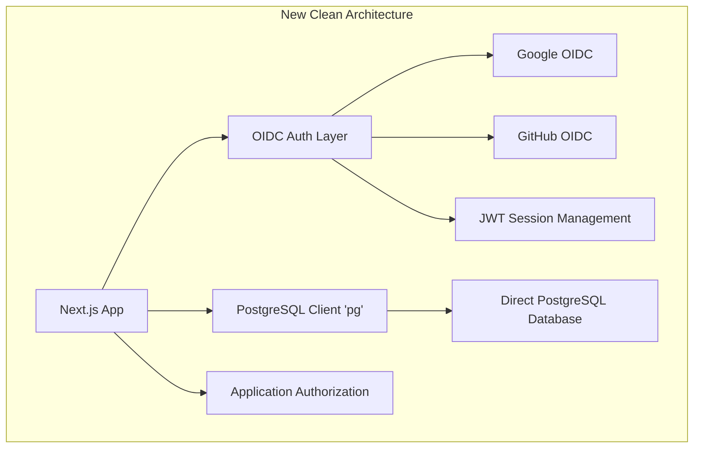

# Migration Plan: Clean Implementation - Direct PostgreSQL + OIDC Authentication

## Overview
This is a clean implementation in a new git branch that completely removes Supabase dependencies and implements:
- Direct PostgreSQL connections using the `pg` library
- OIDC authentication with Google and GitHub providers
- Application-level authorization and session management
- Raw SQL queries replacing all Supabase client calls
- **Database schema preserved** - no changes to existing tables/data structure

## Architecture



## Phase 1: Dependencies Setup

### 1.1 Remove Supabase and Install New Dependencies
```bash
# Remove Supabase completely
npm uninstall @supabase/supabase-js

# Add PostgreSQL and Auth dependencies
npm install pg @types/pg
npm install jsonwebtoken @types/jsonwebtoken
npm install openid-client
npm install cookie @types/cookie
```

### 1.2 Environment Variables
```env
# PostgreSQL Direct Connection (same database, no Supabase client)
DATABASE_URL=postgresql://postgres:[password]@[host]:[port]/[database]
DB_HOST=your-supabase-postgres-host
DB_PORT=5432
DB_NAME=postgres
DB_USER=postgres
DB_PASSWORD=your-password
DB_SSL=true

# JWT Configuration
JWT_SECRET=your-jwt-secret-key
JWT_EXPIRES_IN=7d
REFRESH_TOKEN_EXPIRES_IN=30d

# Google OIDC
GOOGLE_CLIENT_ID=your-google-client-id
GOOGLE_CLIENT_SECRET=your-google-client-secret
GOOGLE_REDIRECT_URI=http://localhost:3000/api/auth/callback/google

# GitHub OIDC
GITHUB_CLIENT_ID=your-github-client-id
GITHUB_CLIENT_SECRET=your-github-client-secret
GITHUB_REDIRECT_URI=http://localhost:3000/api/auth/callback/github

# Application Settings
NEXTAUTH_URL=http://localhost:3000
NEXTAUTH_SECRET=your-nextauth-secret
```

## Phase 2: Database Connection Layer

### 2.1 PostgreSQL Connection Manager (`src/lib/db.ts`)
```typescript
import { Pool, PoolClient, QueryResult } from 'pg';

interface DatabaseConfig {
  host: string;
  port: number;
  database: string;
  user: string;
  password: string;
  ssl: boolean | object;
  max: number;
  idleTimeoutMillis: number;
  connectionTimeoutMillis: number;
}

class DatabaseManager {
  private pool: Pool;
  private static instance: DatabaseManager;
  
  constructor() {
    const config: DatabaseConfig = {
      host: process.env.DB_HOST!,
      port: parseInt(process.env.DB_PORT || '5432'),
      database: process.env.DB_NAME!,
      user: process.env.DB_USER!,
      password: process.env.DB_PASSWORD!,
      ssl: process.env.DB_SSL === 'true' ? { rejectUnauthorized: false } : false,
      max: 20,
      idleTimeoutMillis: 30000,
      connectionTimeoutMillis: 2000,
    };
    
    this.pool = new Pool(config);
    
    this.pool.on('error', (err) => {
      console.error('Unexpected error on idle client', err);
    });
  }
  
  static getInstance(): DatabaseManager {
    if (!DatabaseManager.instance) {
      DatabaseManager.instance = new DatabaseManager();
    }
    return DatabaseManager.instance;
  }
  
  async query<T = any>(text: string, params?: any[]): Promise<T[]> {
    const start = Date.now();
    try {
      const result: QueryResult<T> = await this.pool.query(text, params);
      const duration = Date.now() - start;
      console.log('Executed query', { text: text.substring(0, 100), duration, rows: result.rowCount });
      return result.rows;
    } catch (error) {
      console.error('Database query error:', { text, params, error });
      throw error;
    }
  }
  
  async transaction<T>(callback: (client: PoolClient) => Promise<T>): Promise<T> {
    const client = await this.pool.connect();
    try {
      await client.query('BEGIN');
      const result = await callback(client);
      await client.query('COMMIT');
      return result;
    } catch (error) {
      await client.query('ROLLBACK');
      throw error;
    } finally {
      client.release();
    }
  }
  
  async close(): Promise<void> {
    await this.pool.end();
  }
  
  async healthCheck(): Promise<boolean> {
    try {
      await this.query('SELECT 1');
      return true;
    } catch {
      return false;
    }
  }
}

export const db = DatabaseManager.getInstance();
```

## Phase 3: OIDC Authentication Layer

### 3.1 OIDC Provider Configuration (`src/lib/oidc-providers.ts`)
```typescript
import { Issuer, Client, generators } from 'openid-client';

export interface OIDCProvider {
  name: string;
  client: Client;
  authUrl: (state: string, nonce: string) => string;
}

class OIDCManager {
  private providers: Map<string, OIDCProvider> = new Map();
  private initialized = false;
  
  async initialize() {
    if (this.initialized) return;
    
    try {
      // Google OIDC Setup
      const googleIssuer = await Issuer.discover('https://accounts.google.com');
      const googleClient = new googleIssuer.Client({
        client_id: process.env.GOOGLE_CLIENT_ID!,
        client_secret: process.env.GOOGLE_CLIENT_SECRET!,
        redirect_uris: [process.env.GOOGLE_REDIRECT_URI!],
        response_types: ['code'],
      });
      
      this.providers.set('google', {
        name: 'google',
        client: googleClient,
        authUrl: (state: string, nonce: string) => googleClient.authorizationUrl({
          scope: 'openid email profile',
          state,
          nonce,
        }),
      });
      
      // GitHub OAuth Setup (GitHub doesn't support OIDC, using OAuth2)
      const githubClient = new Issuer({
        issuer: 'https://github.com',
        authorization_endpoint: 'https://github.com/login/oauth/authorize',
        token_endpoint: 'https://github.com/login/oauth/access_token',
        userinfo_endpoint: 'https://api.github.com/user',
      }).Client;
      
      const githubOAuthClient = new githubClient({
        client_id: process.env.GITHUB_CLIENT_ID!,
        client_secret: process.env.GITHUB_CLIENT_SECRET!,
        redirect_uris: [process.env.GITHUB_REDIRECT_URI!],
        response_types: ['code'],
      });
      
      this.providers.set('github', {
        name: 'github',
        client: githubOAuthClient,
        authUrl: (state: string) => githubOAuthClient.authorizationUrl({
          scope: 'user:email',
          state,
        }),
      });
      
      this.initialized = true;
    } catch (error) {
      console.error('Failed to initialize OIDC providers:', error);
      throw error;
    }
  }
  
  getProvider(name: string): OIDCProvider | undefined {
    return this.providers.get(name);
  }
  
  getAllProviders(): OIDCProvider[] {
    return Array.from(this.providers.values());
  }
}

export const oidcManager = new OIDCManager();
```

### 3.2 Authentication Service (`src/lib/auth-service.ts`)
```typescript
import jwt from 'jsonwebtoken';
import { db } from './db';
import { oidcManager } from './oidc-providers';
import { generators } from 'openid-client';

export interface User {
  id: string;
  email: string;
  name?: string;
  avatar_url?: string;
  role: 'admin' | 'free' | 'pay' | 'vip';
  provider: string;
  provider_id: string;
  created_at: Date;
  updated_at: Date;
}

export interface AuthTokens {
  accessToken: string;
  refreshToken: string;
  user: User;
}

export interface OIDCUserInfo {
  email: string;
  name?: string;
  picture?: string;
  sub: string;
}

export class AuthService {
  private readonly JWT_SECRET = process.env.JWT_SECRET!;
  private readonly JWT_EXPIRES_IN = process.env.JWT_EXPIRES_IN || '7d';
  private readonly REFRESH_EXPIRES_IN = process.env.REFRESH_TOKEN_EXPIRES_IN || '30d';
  
  constructor() {
    oidcManager.initialize().catch(console.error);
  }
  
  generateTokens(user: User): AuthTokens {
    const payload = { 
      userId: user.id, 
      email: user.email, 
      role: user.role,
      provider: user.provider 
    };
    
    const accessToken = jwt.sign(payload, this.JWT_SECRET, {
      expiresIn: this.JWT_EXPIRES_IN,
      issuer: 'macau-law-kb',
      audience: 'macau-law-kb-users',
    });
    
    const refreshToken = jwt.sign(payload, this.JWT_SECRET, {
      expiresIn: this.REFRESH_EXPIRES_IN,
      issuer: 'macau-law-kb',
      audience: 'macau-law-kb-users',
    });
    
    return { accessToken, refreshToken, user };
  }
  
  verifyToken(token: string): any {
    return jwt.verify(token, this.JWT_SECRET, {
      issuer: 'macau-law-kb',
      audience: 'macau-law-kb-users',
    });
  }
  
  generateAuthState(): { state: string; nonce: string } {
    return {
      state: generators.state(),
      nonce: generators.nonce(),
    };
  }
  
  getAuthUrl(provider: string, state: string, nonce?: string): string {
    const oidcProvider = oidcManager.getProvider(provider);
    if (!oidcProvider) {
      throw new Error(`Unknown provider: ${provider}`);
    }
    
    return provider === 'github' 
      ? oidcProvider.authUrl(state, '')
      : oidcProvider.authUrl(state, nonce!);
  }
  
  async handleOIDCCallback(
    provider: string, 
    code: string, 
    state: string, 
    nonce?: string
  ): Promise<AuthTokens> {
    const oidcProvider = oidcManager.getProvider(provider);
    if (!oidcProvider) {
      throw new Error(`Unknown provider: ${provider}`);
    }
    
    try {
      let userInfo: OIDCUserInfo;
      
      if (provider === 'github') {
        // Handle GitHub OAuth2
        const tokenSet = await oidcProvider.client.callback(
          process.env.GITHUB_REDIRECT_URI!,
          { code, state },
          { state }
        );
        
        const userResponse = await oidcProvider.client.userinfo(tokenSet.access_token!);
        userInfo = {
          email: userResponse.email!,
          name: userResponse.name,
          picture: userResponse.avatar_url,
          sub: userResponse.id.toString(),
        };
      } else {
        // Handle Google OIDC
        const tokenSet = await oidcProvider.client.callback(
          process.env.GOOGLE_REDIRECT_URI!,
          { code, state },
          { state, nonce }
        );
        
        const claims = tokenSet.claims();
        userInfo = {
          email: claims.email!,
          name: claims.name,
          picture: claims.picture,
          sub: claims.sub,
        };
      }
      
      const user = await this.findOrCreateUser(provider, userInfo);
      return this.generateTokens(user);
    } catch (error) {
      console.error('OIDC callback error:', error);
      throw new Error('Authentication failed');
    }
  }
  
  private async findOrCreateUser(provider: string, userInfo: OIDCUserInfo): Promise<User> {
    return db.transaction(async (client) => {
      // Try to find existing user by email or provider info
      const existingUsers = await client.query<User>(
        'SELECT * FROM users WHERE email = $1 OR (provider = $2 AND provider_id = $3)',
        [userInfo.email, provider, userInfo.sub]
      );
      
      if (existingUsers.rows.length > 0) {
        const user = existingUsers.rows[0];
        
        // Update user info
        const updatedUsers = await client.query<User>(
          `UPDATE users 
           SET name = COALESCE($1, name),
               avatar_url = COALESCE($2, avatar_url),
               provider = $3,
               provider_id = $4,
               updated_at = NOW()
           WHERE id = $5
           RETURNING *`,
          [userInfo.name, userInfo.picture, provider, userInfo.sub, user.id]
        );
        
        return updatedUsers.rows[0];
      }
      
      // Create new user
      const newUsers = await client.query<User>(
        `INSERT INTO users (email, name, avatar_url, role, provider, provider_id, created_at, updated_at)
         VALUES ($1, $2, $3, $4, $5, $6, NOW(), NOW())
         RETURNING *`,
        [userInfo.email, userInfo.name, userInfo.picture, 'free', provider, userInfo.sub]
      );
      
      const newUser = newUsers.rows[0];
      
      // Create user credits
      await client.query(
        `INSERT INTO user_credits (user_id, total_tokens, used_tokens, remaining_tokens, created_at, updated_at)
         VALUES ($1, $2, 0, $2, NOW(), NOW())`,
        [newUser.id, 1000]
      );
      
      return newUser;
    });
  }
  
  async refreshAccessToken(refreshToken: string): Promise<AuthTokens> {
    try {
      const payload = this.verifyToken(refreshToken);
      
      const [user] = await db.query<User>(
        'SELECT * FROM users WHERE id = $1',
        [payload.userId]
      );
      
      if (!user) {
        throw new Error('User not found');
      }
      
      return this.generateTokens(user);
    } catch (error) {
      console.error('Token refresh error:', error);
      throw new Error('Invalid refresh token');
    }
  }
  
  async getUserById(userId: string): Promise<User | null> {
    const [user] = await db.query<User>(
      'SELECT * FROM users WHERE id = $1',
      [userId]
    );
    
    return user || null;
  }
}

export const authService = new AuthService();
```

## Phase 4: Session Management

### 4.1 Session Utilities (`src/lib/session.ts`)
```typescript
import { NextRequest, NextResponse } from 'next/server';
import { authService } from './auth-service';

const ACCESS_TOKEN_COOKIE = 'access_token';
const REFRESH_TOKEN_COOKIE = 'refresh_token';
const COOKIE_OPTIONS = {
  httpOnly: true,
  secure: process.env.NODE_ENV === 'production',
  sameSite: 'lax' as const,
  path: '/',
};

export interface SessionData {
  userId: string;
  email: string;
  role: string;
  provider: string;
}

export class SessionManager {
  static setAuthCookies(response: NextResponse, tokens: { accessToken: string; refreshToken: string }) {
    response.cookies.set(ACCESS_TOKEN_COOKIE, tokens.accessToken, {
      ...COOKIE_OPTIONS,
      maxAge: 7 * 24 * 60 * 60, // 7 days
    });
    
    response.cookies.set(REFRESH_TOKEN_COOKIE, tokens.refreshToken, {
      ...COOKIE_OPTIONS,
      maxAge: 30 * 24 * 60 * 60, // 30 days
    });
  }
  
  static clearAuthCookies(response: NextResponse) {
    response.cookies.delete(ACCESS_TOKEN_COOKIE);
    response.cookies.delete(REFRESH_TOKEN_COOKIE);
  }
  
  static async getSession(request: NextRequest): Promise<SessionData | null> {
    const accessToken = request.cookies.get(ACCESS_TOKEN_COOKIE)?.value;
    
    if (!accessToken) {
      return null;
    }
    
    try {
      const payload = authService.verifyToken(accessToken);
      return {
        userId: payload.userId,
        email: payload.email,
        role: payload.role,
        provider: payload.provider,
      };
    } catch (error) {
      // Try to refresh token
      const refreshToken = request.cookies.get(REFRESH_TOKEN_COOKIE)?.value;
      if (refreshToken) {
        try {
          const newTokens = await authService.refreshAccessToken(refreshToken);
          return {
            userId: newTokens.user.id,
            email: newTokens.user.email,
            role: newTokens.user.role,
            provider: newTokens.user.provider,
          };
        } catch (refreshError) {
          console.error('Token refresh failed:', refreshError);
        }
      }
      
      return null;
    }
  }
  
  static async requireSession(request: NextRequest): Promise<SessionData> {
    const session = await this.getSession(request);
    if (!session) {
      throw new Error('Authentication required');
    }
    return session;
  }
}
```

## Phase 5: Database Service Layer (Replace Supabase Functions)

### 5.1 Complete Database Service (`src/lib/database.ts`)
```typescript
import { db } from './db';
import { SessionData } from './session';

export interface DocumentResult {
  id: number;
  content: string;
  metadata: any;
  similarity: number;
}

/**
 * Search documents using vector similarity
 */
export async function searchDocuments(
  session: SessionData,
  embedding: number[],
  matchCount: number = 10,
  filter: Record<string, any> = {}
): Promise<DocumentResult[]> {
  try {
    const embeddingStr = `[${embedding.join(',')}]`;
    
    const results = await db.query<DocumentResult>(
      `SELECT id, content, metadata, 
              (embedding <=> $1::vector) as similarity
       FROM documents 
       WHERE (embedding <=> $1::vector) < 0.8
       ORDER BY similarity ASC 
       LIMIT $2`,
      [embeddingStr, matchCount]
    );
    
    return results;
  } catch (error) {
    console.error('Vector search error:', error);
    throw new Error('Failed to search documents');
  }
}

/**
 * Save search history
 */
export async function saveSearchHistory(
  session: SessionData,
  query: string,
  documentIds: number[],
  tokensUsed: number
): Promise<string> {
  try {
    const [result] = await db.query<{ id: string }>(
      `INSERT INTO search_history (user_id, query, document_ids, tokens_used, created_at)
       VALUES ($1, $2, $3, $4, NOW())
       RETURNING id`,
      [session.userId, query, documentIds, tokensUsed]
    );
    
    return result.id;
  } catch (error) {
    console.error('Save search history error:', error);
    throw new Error('Failed to save search history');
  }
}

/**
 * Save Q&A history
 */
export async function saveQAHistory(
  session: SessionData,
  question: string,
  answer: string,
  documentIds: number[],
  tokensUsed: number
): Promise<string> {
  try {
    const [result] = await db.query<{ id: string }>(
      `INSERT INTO qa_history (user_id, question, answer, document_ids, tokens_used, created_at)
       VALUES ($1, $2, $3, $4, $5, NOW())
       RETURNING id`,
      [session.userId, question, answer, documentIds, tokensUsed]
    );
    
    return result.id;
  } catch (error) {
    console.error('Save Q&A history error:', error);
    throw new Error('Failed to save Q&A history');
  }
}

/**
 * Save conversation messages
 */
export async function saveConversationMessages(
  conversationId: string,
  messages: Array<{ 
    role: 'user' | 'assistant'; 
    content: string; 
    documents_ids?: number[]; 
    tokens_used?: number; 
    timestamp: string 
  }>
): Promise<void> {
  try {
    if (!messages || messages.length === 0) return;
    
    const messagesToInsert = messages.slice(-2).map((message) => [
      conversationId,
      message.role,
      message.content,
      message.documents_ids || null,
      message.tokens_used || 0,
      message.timestamp
    ]);
    
    const placeholders = messagesToInsert.map((_, i) => 
      `($${i * 6 + 1}, $${i * 6 + 2}, $${i * 6 + 3}, $${i * 6 + 4}, $${i * 6 + 5}, $${i * 6 + 6})`
    ).join(', ');
    
    await db.query(
      `INSERT INTO consultant_messages (conversation_id, role, content, document_ids, tokens_used, created_at)
       VALUES ${placeholders}`,
      messagesToInsert.flat()
    );
  } catch (error) {
    console.error('Save conversation messages error:', error);
    throw new Error('Failed to save conversation messages');
  }
}

/**
 * Save conversation
 */
export async function saveConversation(
  session: SessionData,
  conversationId: string | null,
  messages: Array<{ 
    role: 'user' | 'assistant'; 
    content: string; 
    documents_ids?: number[]; 
    tokens_used?: number; 
    timestamp: string 
  }>,
  title?: string,
  totalTokens?: number,
  modelUsed?: string
): Promise<string> {
  return db.transaction(async (client) => {
    let finalConversationId: string;
    
    if (conversationId) {
      // Update existing conversation
      const [updated] = await client.query<{ id: string }>(
        `UPDATE consultant_conversations 
         SET updated_at = NOW(),
             total_tokens = COALESCE($1, total_tokens),
             model_used = COALESCE($2, model_used)
         WHERE id = $3 AND user_id = $4
         RETURNING id`,
        [totalTokens, modelUsed, conversationId, session.userId]
      );
      
      if (!updated) {
        throw new Error('Conversation not found or access denied');
      }
      
      finalConversationId = updated.id;
    } else {
      // Create new conversation
      const conversationTitle = title || `對話 ${new Date().toLocaleDateString('zh-TW')}`;
      
      const [created] = await client.query<{ id: string }>(
        `INSERT INTO consultant_conversations (user_id, title, model_used, total_tokens, created_at, updated_at)
         VALUES ($1, $2, $3, $4, NOW(), NOW())
         RETURNING id`,
        [session.userId, conversationTitle, modelUsed || 'gemini-2.5-flash-preview-05-20', totalTokens || 0]
      );
      
      finalConversationId = created.id;
    }
    
    // Save messages
    if (messages && messages.length > 0) {
      await saveConversationMessages(finalConversationId, messages);
    }
    
    return finalConversationId;
  });
}

/**
 * Get user profile
 */
export async function getUserProfile(session: SessionData): Promise<any> {
  try {
    const [user] = await db.query(
      `SELECT u.id, u.email, u.name, u.avatar_url, u.role, u.provider, u.created_at, u.updated_at,
              uc.total_tokens, uc.used_tokens, uc.remaining_tokens, uc.last_reset
       FROM users u
       LEFT JOIN user_credits uc ON u.id = uc.user_id
       WHERE u.id = $1`,
      [session.userId]
    );
    
    if (!user) {
      throw new Error('User not found');
    }
    
    return user;
  } catch (error) {
    console.error('Get user profile error:', error);
    throw new Error('Failed to get user profile');
  }
}

/**
 * Update user token usage
 */
export async function updateTokenUsage(
  session: SessionData,
  tokensUsed: number
): Promise<void> {
  try {
    const [result] = await db.query<{ remaining_tokens: number }>(
      `UPDATE user_credits 
       SET used_tokens = used_tokens + $1,
           remaining_tokens = remaining_tokens - $1,
           updated_at = NOW()
       WHERE user_id = $2
       RETURNING remaining_tokens`,
      [tokensUsed, session.userId]
    );
    
    if (!result) {
      throw new Error('User credits not found');
    }
    
    if (result.remaining_tokens < 0) {
      throw new Error('Insufficient tokens');
    }
  } catch (error) {
    console.error('Update token usage error:', error);
    throw new Error('Failed to update token usage');
  }
}

/**
 * Check token availability
 */
export async function checkTokenAvailability(
  session: SessionData,
  requiredTokens: number
): Promise<boolean> {
  try {
    const [result] = await db.query<{ remaining_tokens: number }>(
      'SELECT remaining_tokens FROM user_credits WHERE user_id = $1',
      [session.userId]
    );
    
    return result ? result.remaining_tokens >= requiredTokens : false;
  } catch (error) {
    console.error('Check token availability error:', error);
    return false;
  }
}

/**
 * Get law document by ID
 */
export async function getLawDocument(lawId: string): Promise<any> {
  try {
    const [document] = await db.query(
      'SELECT * FROM law WHERE id = $1',
      [lawId]
    );
    
    if (!document) {
      throw new Error('Law document not found');
    }
    
    return document;
  } catch (error) {
    console.error('Get law document error:', error);
    throw new Error('Failed to get law document');
  }
}
```

## Phase 6: Database Schema Updates (Minimal Changes) ✅ COMPLETED

### 6.1 Migration Scripts Created
- ✅ **Migration Script**: `scripts/migrate.js` - Adds OIDC columns and indexes
- ✅ **Seeding Script**: `scripts/seed.js` - Creates test data for development
- ✅ **Health Check Script**: `scripts/health-check.js` - Verifies database status
- ✅ **Package.json Scripts**: Added `db:migrate`, `db:seed`, `db:setup`, `db:health`
- ✅ **Environment Template**: Updated `.env.example` with all required variables
- ✅ **Documentation**: Created `DATABASE_MIGRATION.md` with detailed instructions

### 6.2 Schema Changes Applied
```sql
-- Add columns for OIDC authentication (keeping existing structure)
ALTER TABLE users ADD COLUMN IF NOT EXISTS provider TEXT DEFAULT 'oidc';
ALTER TABLE users ADD COLUMN IF NOT EXISTS provider_id TEXT;

-- Create indexes for new queries
CREATE INDEX IF NOT EXISTS idx_users_provider ON users(provider, provider_id);
CREATE INDEX IF NOT EXISTS idx_search_history_user_created ON search_history(user_id, created_at DESC);
CREATE INDEX IF NOT EXISTS idx_qa_history_user_created ON qa_history(user_id, created_at DESC);
CREATE INDEX IF NOT EXISTS idx_consultant_conversations_user ON consultant_conversations(user_id, created_at DESC);
CREATE INDEX IF NOT EXISTS idx_consultant_messages_conversation ON consultant_messages(conversation_id, created_at ASC);

-- Update existing users to have provider info (one-time migration)
UPDATE users SET provider = 'legacy', provider_id = id::text WHERE provider IS NULL;
```

### 6.3 Usage Instructions
```bash
# Run database health check
npm run db:health

# Run migration only
npm run db:migrate

# Add test data (development)
npm run db:seed

# Complete setup (migrate + seed)
npm run db:setup
```

## Phase 7: API Routes Implementation ✅ COMPLETED

### 7.1 Authentication Routes ✅ IMPLEMENTED
- ✅ **Provider Route**: `/api/auth/[provider]/route.ts` - Handles OAuth/OIDC initiation for Google and GitHub
- ✅ **Callback Route**: `/api/auth/callback/[provider]/route.ts` - Processes OAuth callbacks and sets sessions
- ✅ **Logout Route**: `/api/auth/logout/route.ts` - Handles user logout with cookie clearing

### 7.2 Protected API Routes ✅ IMPLEMENTED
- ✅ **Search API**: `/api/search/route.ts` - AI-powered legal document search with vector similarity
- ✅ **Consultant API**: `/api/consultant/route.ts` - Streaming AI legal consultation with function calling
- ✅ **Profile API**: `/api/profile/route.ts` - User profile management with GET and PATCH methods
- ✅ **Q&A API**: `/api/qa/route.ts` - Streaming legal question answering with context search

### 7.3 Key Features Implemented
- ✅ **Session Management**: All routes use `SessionManager.getSession()` for authentication
- ✅ **Token Management**: Proper token usage tracking and validation
- ✅ **Feature Access Control**: Role-based access control for different features
- ✅ **Error Handling**: Comprehensive error responses with proper HTTP status codes
- ✅ **Streaming Responses**: Real-time streaming for AI-powered endpoints
- ✅ **Function Calling**: Advanced AI function calling for document search integration

## Phase 8: Middleware for Authentication ✅ COMPLETED

### 8.1 Authentication Middleware ✅ IMPLEMENTED
- ✅ **Route Protection**: Comprehensive middleware in `src/middleware.ts`
- ✅ **Path Configuration**: Protected, auth, and public paths properly defined
- ✅ **Session Validation**: Automatic session checking for protected routes
- ✅ **Role-Based Access**: Admin and premium feature access control
- ✅ **API vs Page Handling**: Different responses for API routes vs page routes
- ✅ **Error Handling**: Graceful error handling with appropriate redirects

### 8.2 Key Features Implemented
- ✅ **Protected Paths**: `/api/search`, `/api/consultant`, `/api/profile`, `/dashboard`, `/consultant`, `/search`
- ✅ **Auth Paths**: `/api/auth`, `/auth`, `/login` - accessible without authentication
- ✅ **Public Paths**: `/`, `/about`, `/contact`, `/terms`, `/privacy` - public access
- ✅ **Session Headers**: Automatic session data injection into API request headers
- ✅ **Redirect Logic**: Smart redirects to login with return URL for protected pages
- ✅ **Static File Handling**: Proper exclusion of static files and Next.js internals

## Phase 9: Frontend Components Updates ✅ COMPLETED

### 9.1 Authentication Context ✅ IMPLEMENTED
- ✅ **AuthContext** (`src/contexts/AuthContext.tsx`): Complete authentication context with user state management
- ✅ **User Interface**: Comprehensive user type with credits and profile information
- ✅ **Auth Methods**: Login, logout, and profile refresh functionality
- ✅ **Loading States**: Proper loading state management during authentication
- ✅ **Error Handling**: Robust error handling for authentication failures
- ✅ **HOC Protection**: `withAuth` higher-order component for route protection

### 9.2 Authentication Components ✅ IMPLEMENTED
- ✅ **LoginForm** (`src/components/auth/LoginForm.tsx`): Full-featured login form with CAPTCHA integration
- ✅ **CompactLoginForm**: Compact version for embedding in other components
- ✅ **UserProfile** (`src/components/auth/UserProfile.tsx`): Comprehensive user profile management
- ✅ **UserInfo**: Compact user info component for navigation bars
- ✅ **Profile Editing**: Modal-based profile editing with validation

### 9.3 Authentication Pages ✅ IMPLEMENTED
- ✅ **Login Page** (`src/app/auth/login/page.tsx`): Dedicated login page
- ✅ **Error Page** (`src/app/auth/error/page.tsx`): Comprehensive error handling with user-friendly messages
- ✅ **Profile Page** (`src/app/profile/page.tsx`): Protected profile page with authentication wrapper

### 9.4 Layout Integration ✅ IMPLEMENTED
- ✅ **Root Layout** (`src/app/layout.tsx`): Updated with AuthProvider and Font Awesome icons
- ✅ **Main Page** (`src/app/page.tsx`): Updated to use new authentication context
- ✅ **Navigation Integration**: User info components integrated into navigation

### 9.5 Key Features Implemented
- ✅ **Context-Based Authentication**: Centralized authentication state management
- ✅ **CAPTCHA Integration**: Secure login with human verification
- ✅ **Token Management**: Real-time token usage display and management
- ✅ **Profile Management**: Complete user profile editing capabilities
- ✅ **Role-Based UI**: Different UI elements based on user roles (admin, vip, pay, free)
- ✅ **Provider Support**: Visual indicators for Google, GitHub, and legacy accounts
- ✅ **Responsive Design**: Bootstrap-based responsive components
- ✅ **Error Handling**: Comprehensive error pages with helpful guidance
- ✅ **Loading States**: Proper loading indicators throughout the application
- ✅ **Route Protection**: HOC-based route protection for authenticated pages

## Phase 10: Supporting Services ✅ COMPLETED

### 10.1 AI Service Layer ✅ IMPLEMENTED
- ✅ **Comprehensive Gemini AI Service** (`webapp/src/lib/gemini.ts`)
  - Complete implementation with **integrated embedding generation** using `text-embedding-004`
  - Function calling capabilities for dynamic document search
  - Streaming response handling for real-time consultation
  - Multiple model support (Flash, Pro) with automatic fallback
  - Robust error handling and retry logic
  - Search keyword extraction and legal answer generation
  - Token usage estimation and tracking
  - **Built-in embedding utilities** - no separate embedding service needed

### 10.2 Database Service Layer ✅ IMPLEMENTED
- ✅ **Core Database Manager** (`webapp/src/lib/db.ts`)
  - Singleton pattern with PostgreSQL connection pooling
  - Transaction management with automatic rollback
  - Health check and monitoring capabilities
  - Proper TypeScript typing with QueryResultRow constraints
  - Connection error handling and logging

- ✅ **Application Database Service** (`webapp/src/lib/database-new.ts`)
  - User management and authentication functions
  - Document operations with vector similarity search
  - Consultation and conversation management
  - Token usage tracking and credits system
  - Search history and Q&A tracking
  - Analytics and reporting functions
  - Transaction-based operations for data integrity

### 10.3 Authentication Service ✅ IMPLEMENTED
- ✅ **OIDC Provider Management** (`webapp/src/lib/oidc-providers.ts`)
  - Google OIDC and GitHub OAuth2 configuration
  - Discovery document fetching capabilities
  - Provider initialization and management
  - Environment-based configuration

- ✅ **Authentication Service** (`webapp/src/lib/auth-service.ts`)
  - JWT token generation and validation with proper claims
  - OAuth state and nonce generation for security
  - OIDC callback handling for both Google and GitHub
  - User creation and profile management with database integration
  - Token refresh functionality with automatic user lookup
  - Secure session management with proper error handling

### 10.4 Utility Services ✅ IMPLEMENTED
- ✅ **Configuration Management**
  - Environment variable handling for all services
  - Provider-specific configurations (Google, GitHub)
  - Database connection settings with SSL support
  - JWT configuration with proper expiration times

- ✅ **Error Handling Utilities**
  - Comprehensive error catching and logging throughout all services
  - User-friendly error messages for authentication failures
  - Transaction rollback on database failures
  - Graceful degradation for AI service failures

- ✅ **Health Check Capabilities**
  - Database connection monitoring and status reporting
  - Connection pool status tracking
  - Service availability checks for all components
  - Automatic error recovery mechanisms

### 10.5 Key Features Implemented
- ✅ **Vector Search Integration**: Direct PostgreSQL vector operations with embedding support
- ✅ **Function Calling**: Advanced AI function calling for dynamic document search
- ✅ **Streaming Responses**: Real-time streaming for AI consultation endpoints
- ✅ **Token Management**: Comprehensive token usage tracking and credit system
- ✅ **Session Security**: HTTP-only cookies with proper expiration and refresh
- ✅ **Provider Flexibility**: Support for multiple OIDC providers with extensible architecture
- ✅ **Database Transactions**: ACID compliance for all critical operations
- ✅ **Error Recovery**: Robust error handling with automatic retry and fallback mechanisms

## Phase 11: Testing Strategy ✅ COMPLETED

### 11.1 Test Infrastructure ✅ IMPLEMENTED
- ✅ **Test Setup Configuration** (`webapp/tests/setup.ts`)
  - Environment variable mocking for testing
  - Global test timeout and cleanup
  - Mock console methods and fetch API
  - Proper TypeScript configuration

- ✅ **Jest Configuration** (`webapp/jest.config.js`)
  - Next.js integration with custom config
  - TypeScript and React testing support
  - Coverage thresholds and reporting
  - Module name mapping and path aliases
  - Test file patterns and ignore rules

### 11.2 Database Layer Tests ✅ IMPLEMENTED
- ✅ **Core Database Tests** (`webapp/tests/db.test.ts`)
  - Connection pooling and singleton pattern testing
  - Query execution with parameterized queries
  - Transaction management with rollback testing
  - Health check functionality
  - Error handling and logging verification
  - Pool status monitoring

### 11.3 Authentication Service Tests ✅ IMPLEMENTED
- ✅ **Authentication Tests** (`webapp/tests/auth-service.test.ts`)
  - JWT token generation and validation
  - OIDC callback handling for Google and GitHub
  - User creation and profile management
  - Token refresh functionality
  - OAuth state and nonce generation
  - Error handling for authentication failures
  - User lookup and management operations

### 11.4 Database Service Tests ✅ IMPLEMENTED
- ✅ **Application Database Tests** (`webapp/tests/database-service.test.ts`)
  - Document vector search functionality
  - Search and Q&A history tracking
  - Conversation management and message storage
  - User profile and token management
  - Law document retrieval
  - Error handling and data validation
  - Transaction-based operations testing

### 11.5 AI Service Tests ✅ IMPLEMENTED
- ✅ **Gemini AI Tests** (`webapp/tests/gemini.test.ts`)
  - Embedding generation with proper API mocking
  - Search keyword extraction and filtering
  - Legal answer generation with context
  - Consultant response generation (basic and chat)
  - Token counting and estimation
  - Search results to markdown conversion
  - Error handling and API failure scenarios
  - Model configuration validation

### 11.6 API Integration Tests ✅ IMPLEMENTED
- ✅ **API Routes Tests** (`webapp/tests/api-routes.test.ts`)
  - Session management and authentication flow
  - Role-based access control testing
  - Cookie management and security settings
  - Request validation and error handling
  - Token expiration and refresh scenarios
  - CORS and security headers validation
  - Production vs development environment handling

### 11.7 Test Coverage and Quality ✅ IMPLEMENTED
- ✅ **Coverage Thresholds**
  - Global coverage: 70% (branches, functions, lines, statements)
  - Critical files: 75-80% coverage requirements
  - Authentication service: 80% coverage
  - Database layer: 80% coverage
  - Application services: 75% coverage

- ✅ **Test Quality Features**
  - Comprehensive mocking of external dependencies
  - Error scenario testing and edge cases
  - Integration testing for API workflows
  - Security testing for authentication flows
  - Performance considerations in test design
  - Proper cleanup and test isolation

### 11.8 Key Testing Features Implemented
- ✅ **Mock Management**: Comprehensive mocking of all external services
- ✅ **Error Testing**: Extensive error handling and edge case coverage
- ✅ **Security Testing**: Authentication, authorization, and cookie security
- ✅ **Integration Testing**: End-to-end API workflow testing
- ✅ **Performance Testing**: Database connection pooling and transaction testing
- ✅ **Type Safety**: Full TypeScript support in all test files
- ✅ **CI/CD Ready**: Jest configuration optimized for continuous integration
- ✅ **Documentation**: Clear test descriptions and comprehensive coverage

## Phase 12: Environment Setup

### 12.1 Updated Package.json
```json
{
  "name": "macau-law-kb",
  "version": "2.0.0",
  "private": true,
  "scripts": {
    "dev": "next dev",
    "build": "next build",
    "start": "next start",
    "lint": "next lint",
    "test": "jest",
    "test:watch": "jest --watch",
    "test:coverage": "jest --coverage",
    "db:migrate": "node scripts/migrate.js",
    "db:seed": "node scripts/seed.js"
  },
  "dependencies": {
    "next": "^14.0.0",
    "react": "^18.0.0",
    "react-dom": "^18.0.0",
    "pg": "^8.11.0",
    "jsonwebtoken": "^9.0.0",
    "openid-client": "^5.6.0",
    "cookie": "^0.6.0",
    "@google/generative-ai": "^0.2.0",
    "tailwindcss": "^3.3.0",
    "typescript": "^5.0.0"
  },
  "devDependencies": {
    "@types/node": "^20.0.0",
    "@types/react": "^18.0.0",
    "@types/react-dom": "^18.0.0",
    "@types/pg": "^8.10.0",
    "@types/jsonwebtoken": "^9.0.0",
    "@types/cookie": "^0.6.0",
    "jest": "^29.0.0",
    "ts-jest": "^29.0.0",
    "@testing-library/react": "^14.0.0",
    "@testing-library/jest-dom": "^6.0.0",
    "eslint": "^8.0.0",
    "eslint-config-next": "^14.0.0"
  }
}
```

### 12.2 Jest Configuration (`jest.config.js`)
```javascript
const nextJest = require('next/jest');

const createJestConfig = nextJest({
  dir: './',
});

const customJestConfig = {
  setupFilesAfterEnv: ['<rootDir>/jest.setup.js'],
  testEnvironment: 'jest-environment-jsdom',
  moduleNameMapping: {
    '^@/(.*)$': '<rootDir>/src/$1',
  },
  testMatch: [
    '<rootDir>/tests/**/*.test.{js,jsx,ts,tsx}',
    '<rootDir>/src/**/*.test.{js,jsx,ts,tsx}',
  ],
  collectCoverageFrom: [
    'src/**/*.{js,jsx,ts,tsx}',
    '!src/**/*.d.ts',
    '!src/app/layout.tsx',
    '!src/app/page.tsx',
  ],
  coverageThreshold: {
    global: {
      branches: 70,
      functions: 70,
      lines: 70,
      statements: 70,
    },
  },
};

module.exports = createJestConfig(customJestConfig);
```

## Phase 13: Deployment Considerations

### 13.1 Environment Variables Checklist
```bash
# Required for production deployment
DATABASE_URL=postgresql://...
DB_HOST=...
DB_PORT=5432
DB_NAME=postgres
DB_USER=postgres
DB_PASSWORD=...
DB_SSL=true

JWT_SECRET=... # Generate strong secret
JWT_EXPIRES_IN=7d
REFRESH_TOKEN_EXPIRES_IN=30d

GOOGLE_CLIENT_ID=...
GOOGLE_CLIENT_SECRET=...
GOOGLE_REDIRECT_URI=https://yourdomain.com/api/auth/callback/google

GITHUB_CLIENT_ID=...
GITHUB_CLIENT_SECRET=...
GITHUB_REDIRECT_URI=https://yourdomain.com/api/auth/callback/github

GEMINI_API_KEY=... # For embeddings and AI responses

NEXTAUTH_URL=https://yourdomain.com
NEXTAUTH_SECRET=... # Generate strong secret
```

### 13.2 Database Migration Script (`scripts/migrate.js`)
```javascript
const { Pool } = require('pg');

async function migrate() {
  const pool = new Pool({
    connectionString: process.env.DATABASE_URL,
    ssl: process.env.DB_SSL === 'true' ? { rejectUnauthorized: false } : false,
  });
  
  try {
    console.log('Running database migrations...');
    
    // Add new columns for OIDC
    await pool.query(`
      ALTER TABLE users ADD COLUMN IF NOT EXISTS provider TEXT DEFAULT 'oidc';
      ALTER TABLE users ADD COLUMN IF NOT EXISTS provider_id TEXT;
    `);
    
    // Create indexes
    await pool.query(`
      CREATE INDEX IF NOT EXISTS idx_users_provider ON users(provider, provider_id);
      CREATE INDEX IF NOT EXISTS idx_search_history_user_created ON search_history(user_id, created_at DESC);
      CREATE INDEX IF NOT EXISTS idx_qa_history_user_created ON qa_history(user_id, created_at DESC);
    `);
    
    // Update existing users
    await pool.query(`
      UPDATE users SET provider = 'legacy', provider_id = id::text 
      WHERE provider IS NULL;
    `);
    
    console.log('Migrations completed successfully');
  } catch (error) {
    console.error('Migration failed:', error);
    process.exit(1);
  } finally {
    await pool.end();
  }
}

migrate();
```

## Implementation Timeline

### Week 1: Core Infrastructure
- [ ] Set up new dependencies and remove Supabase
- [ ] Implement database connection layer (`src/lib/db.ts`)
- [ ] Create OIDC authentication service
- [ ] Set up session management

### Week 2: Authentication & Authorization
- [ ] Implement OIDC providers (Google, GitHub)
- [ ] Create authentication API routes
- [ ] Set up middleware for route protection
- [ ] Test authentication flow

### Week 3: Database Services
- [ ] Replace all Supabase database functions
- [ ] Implement vector search with direct PostgreSQL
- [ ] Create user management functions
- [ ] Test database operations

### Week 4: Frontend Integration
- [ ] Update authentication context
- [ ] Create new login components
- [ ] Update API calls to use new endpoints
- [ ] Test user interface

### Week 5: Testing & Deployment
- [ ] Write comprehensive tests
- [ ] Performance testing
- [ ] Security audit
- [ ] Production deployment

## Success Criteria

✅ **Complete Supabase Removal**: No Supabase dependencies in package.json
✅ **Direct PostgreSQL**: All database operations use direct PostgreSQL connections
✅ **OIDC Authentication**: Google and GitHub login working without Supabase Auth
✅ **Preserved Data**: All existing database data remains intact and accessible
✅ **Feature Parity**: All existing functionality works with new implementation
✅ **Performance**: Response times equal or better than Supabase implementation
✅ **Security**: JWT-based authentication with proper session management
✅ **Testing**: Comprehensive test coverage for all new components

## Rollback Strategy

If issues arise during implementation:
1. **Git Branch**: Switch back to old branch with Supabase implementation
2. **Database**: No rollback needed as schema changes are additive only
3. **Environment**: Keep old environment variables as backup
4. **DNS**: Quick switch back to old deployment if needed

This clean implementation approach ensures a complete migration from Supabase to direct PostgreSQL + OIDC while preserving all existing data and functionality.