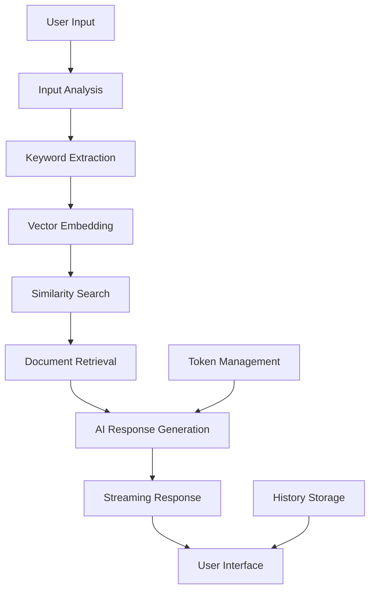

# Macau Law Knowledge Base Web Application

A comprehensive AI-powered legal search, Q&A, and consultation platform for Macau law, built with Next.js, Supabase, and Google Gemini AI.

## Overview of Core Logic / Architecture

### System Architecture

```
┌─────────────────┐    ┌─────────────────┐    ┌─────────────────┐
│   Frontend      │    │   Backend API   │    │   AI Services   │
│   (Next.js)     │◄──►│   (Next.js API) │◄──►│   (Gemini AI)   │
└─────────────────┘    └─────────────────┘    └─────────────────┘
         │                       │                       │
         │                       │                       │
         ▼                       ▼                       ▼
┌─────────────────┐    ┌─────────────────┐    ┌─────────────────┐
│   User Auth     │    │   Vector DB     │    │   Embedding     │
│   (Supabase)    │    │   (Supabase)    │    │   Generation    │
└─────────────────┘    └─────────────────┘    └─────────────────┘
```

### Core Features

1. **Legal Search**: AI-powered vector search through legal documents
2. **Legal Q&A**: Intelligent question-answering based on legal content
3. **Legal Consultant**: Interactive AI chat for legal consultation

### AI Workflow



## Codebase Structure

```
webapp/
├── src/
│   ├── app/                    # Next.js App Router
│   │   ├── layout.tsx         # Root layout
│   │   ├── page.tsx           # Home page
│   │   ├── globals.css        # Global styles
│   │   ├── auth/
│   │   │   └── callback/      # OAuth callback
│   │   ├── search/            # Legal search pages
│   │   ├── qa/                # Q&A pages
│   │   ├── consultant/        # Consultant chat pages
│   │   ├── profile/           # User profile
│   │   ├── admin/             # Admin dashboard
│   │   └── api/               # API routes
│   │       ├── auth/          # Authentication
│   │       ├── search/        # Search endpoints
│   │       ├── qa/            # Q&A endpoints
│   │       └── consultant/    # Consultant endpoints
│   ├── components/            # Reusable UI components
│   │   ├── ui/               # Basic UI components
│   │   ├── search/           # Search-related components
│   │   ├── chat/             # Chat interface components
│   │   └── layout/           # Layout components
│   ├── lib/                  # Core utilities
│   │   ├── supabase.ts       # Database client
│   │   ├── gemini.ts         # AI integration
│   │   ├── auth.ts           # Authentication
│   │   └── vector-search.ts  # Vector search utilities
│   ├── types/                # TypeScript definitions
│   │   └── index.ts          # Type definitions
│   └── middleware.ts         # JWT/CSRF protection
├── tests/                    # Test files
├── database-schema.sql       # Database schema
├── package.json             # Dependencies
├── jest.config.js           # Test configuration
├── .env.example             # Environment variables template
└── README.md               # This file
```

## Quick Start Guide

### Prerequisites

- Node.js 18+ and npm
- Supabase account and project
- Google AI API key (for Gemini)
- Google OAuth app (for authentication)
- GitHub OAuth app (for authentication)

### Installation Steps

1. **Clone and Setup**
   ```bash
   cd webapp
   npm install
   ```

2. **Environment Configuration**
   ```bash
   cp .env.example .env.local
   ```
   
   Fill in your environment variables:
   ```env
   # Supabase Configuration
   NEXT_PUBLIC_SUPABASE_URL=your_supabase_url
   NEXT_PUBLIC_SUPABASE_ANON_KEY=your_supabase_anon_key
   SUPABASE_SERVICE_ROLE_KEY=your_supabase_service_role_key
   
   # Google Gemini AI Configuration
   GEMINI_API_KEY=your_google_ai_api_key
   
   # JWT and Security
   JWT_SECRET=your_jwt_secret_minimum_32_characters
   CSRF_SECRET=your_csrf_secret_minimum_32_characters
   ```

3. **Database Setup**
   - Execute the SQL in `database-schema.sql` in your Supabase SQL editor
   - Ensure the vector extension and documents table are properly configured
   - Set up Row Level Security (RLS) policies

4. **Authentication Setup**
   - Configure Google OAuth in Supabase Auth settings
   - Configure GitHub OAuth in Supabase Auth settings
   - Add your domain to allowed redirect URLs

5. **Run the Application**
   ```bash
   npm run dev
   ```
   
   The application will be available at `http://localhost:3000`

### How to Run the Application

#### Development Mode
```bash
npm run dev          # Start development server with hot reload
npm run test:watch   # Run tests in watch mode
```

#### Production Mode
```bash
npm run build        # Build for production
npm run start        # Start production server
```

#### Testing
```bash
npm run test         # Run all tests
npm run test:coverage # Run tests with coverage report
npm run type-check   # TypeScript type checking
```

### Common Issues and Troubleshooting

#### Authentication Issues
- **Problem**: OAuth redirect fails
- **Solution**: Check redirect URLs in Supabase Auth settings match your domain

#### Database Connection Issues
- **Problem**: Cannot connect to Supabase
- **Solution**: Verify environment variables and check Supabase project status

#### AI API Issues
- **Problem**: Gemini API calls fail
- **Solution**: Verify Google AI API key and check quota limits

#### Vector Search Issues
- **Problem**: Search returns no results
- **Solution**: Ensure documents table has data and embeddings are generated

## User Roles and Permissions

### Admin
- Full access to all features
- Can view all user data and history
- Can manage user roles and token allocations
- Access to admin dashboard

### Free Tier
- 1000 free tokens per month
- Access to Legal Search (with token limits)
- Access to Legal Q&A (with token limits)
- No access to Legal Consultant

### Pay Tier
- 1000 free tokens + paid tokens
- Unlimited Legal Search
- Access to Legal Q&A (with token counting)
- Access to Legal Consultant (with token counting)

### VIP Tier
- Same as Pay Tier
- Access to premium Gemini Pro model in Legal Consultant
- Priority support

## API Endpoints

### Authentication
- `POST /api/auth/login` - Initiate OAuth login
- `GET /api/auth/callback` - Handle OAuth callback
- `POST /api/auth/logout` - User logout
- `GET /api/auth/csrf` - Get CSRF token

### Legal Search
- `POST /api/search` - Perform legal document search
- `GET /api/search/history` - Get user search history
- `GET /api/search/suggestions` - Get search suggestions

### Legal Q&A
- `POST /api/qa` - Submit question and get AI answer
- `GET /api/qa/history` - Get user Q&A history

### Legal Consultant
- `POST /api/consultant/conversations` - Create new conversation
- `GET /api/consultant/conversations` - Get user conversations
- `POST /api/consultant/chat` - Send message in conversation
- `GET /api/consultant/conversations/:id/messages` - Get conversation messages

### User Management
- `GET /api/user/profile` - Get user profile
- `PUT /api/user/profile` - Update user profile
- `GET /api/user/credits` - Get user token credits
- `GET /api/user/usage` - Get user token usage statistics

### Admin
- `GET /api/admin/users` - List all users
- `PUT /api/admin/users/:id/role` - Update user role
- `GET /api/admin/statistics` - Get system statistics
- `GET /api/admin/logs` - Get admin action logs

## Security Features

### Authentication & Authorization
- OAuth 2.0 with Google and GitHub
- JWT tokens for API authentication
- CSRF protection for state-changing operations
- Row Level Security (RLS) in database

### Data Protection
- Sensitive data stored server-side only
- API keys and secrets in environment variables
- Input validation and sanitization
- Rate limiting on API endpoints

### Privacy
- User data isolation with RLS policies
- Secure session management
- Audit logging for admin actions

## Development Guidelines

### Code Quality
- TypeScript for type safety
- ESLint for code linting
- Jest for unit testing
- JSDoc comments for all functions

### Testing Strategy
- Unit tests for all utility functions
- Integration tests for API endpoints
- Component tests for React components
- Minimum 70% code coverage

### Performance Optimization
- Server-side rendering with Next.js
- Vector search for fast document retrieval
- Streaming responses for AI interactions
- Optimized database queries with indexes

## Deployment

### Environment Setup
1. Set up production environment variables
2. Configure Supabase for production
3. Set up domain and SSL certificates
4. Configure OAuth providers for production URLs

### Build and Deploy
```bash
npm run build
npm run start
```

### Monitoring
- Monitor API response times
- Track token usage and costs
- Monitor database performance
- Set up error logging and alerts

## Contributing

1. Fork the repository
2. Create a feature branch
3. Write tests for new functionality
4. Ensure all tests pass
5. Submit a pull request

## License

This project is proprietary software for Macau Law Knowledge Base.

## Support

For technical support or questions, please contact the development team.
